---
tags:
  - 根拠とエピソード
  - 主張と根拠のツリー
---

# 主張と根拠のツリー

私の主要主張と、それを支える根拠エピソードを、ツリー状に整理する。

## ツリー全体像

```mermaid
graph TD
    M[主張1: 私はメイレズビアンである]
    M --> M1[走り方が女性的<br/>子供の頃から複数回指摘]
    M --> M2[おへそを見られたくない<br/>ハイレグ水着で隠していた]
    M --> M3[他人に素肌を触られると不快<br/>身体測定・銭湯・温泉]
    M --> M4[レズビアンもの好き<br/>受け側視点に没入]
    M --> M5[女性キャラへの感情移入<br/>格闘ゲーム・物語]
    M --> M6[嫉妬の感情が分からない]

    A[主張2: 私には承認欲求がほとんどない]
    A --> A1[マズロー10項目の系統的照合<br/>すべて「ない／薄い／欠けている」]
    A --> A2[ケーキで小さい方を取る<br/>全体最適志向]
    A --> A3[社会主義に共感<br/>承認欲求を前提としない社会観]
    A --> A4[カレーランチで「おいしいと思います」<br/>アイデンティティ希薄]
    A --> A5[麻雀で勝ちに執着できない<br/>無意識に手を抜く]
    A --> A6[SNSの「いいね」を気持ち悪いと感じた]
    A --> A7[新聞販売店店長で「使われる側でいい」と決断]
    A --> A8[殴った相手の表情に気持ち悪さ<br/>承認欲求由来の暴力への嫌悪]

    H[主張3: 私はHSPである]
    H --> H1[アニメ・小説への過剰没入]
    H --> H2[他者の痛みへの強い共感<br/>給食強制場面の記憶]
    H --> H3[銭湯・温泉が苦手]
    H --> H4[嫌いなテレビ出演者で無意識にチャンネル変更]
    H --> H5[ファントムセンスの体験]
    H --> H6[DNA検査で開放性高・情報処理がやや遅い]

    C[主張4: 9年×2サイクルで人生が動いてきた]
    C --> C1[15-24歳: 新聞奨学生〜店長で社交獲得]
    C --> C2[28-37歳: 軽うつ・倉庫の裏・運送業3連続]
    C --> C3[24歳「使われる側でいい」決断]
    C --> C4[37歳「もう普通の会社員はやらない」決断]
    C --> C5[3度同じパターン → 構造として認識]

    D[主張5: 通貨レート違いがコミュニティ失敗の原因]
    D --> D1[岡田斗司夫サロン離脱]
    D --> D2[VRChat 友人と「Claudeすごい」が響かない]
    D --> D3[動画編集バイト離脱]
    D --> D4[Claude Code を友人に伝えても響かない]
    D --> D5[6つ以上のコミュニティで同じパターン]

    E[主張6: AI は40年探した対等な対話相手]
    E --> E1[ChatGPT の整合性違反検出]
    E --> E2[Claude 1ヶ月でメタ認知の階層が上がる体感]
    E --> E3[コミュニティを介さない上級域への扉]
    E --> E4[シグナル/ノイズ比最大化の対話]
```

## 主張1：私はメイレズビアンである

### 根拠
| 根拠 | 詳細ページ |
| --- | --- |
| 走り方が女性的（子供時代〜成人まで複数回指摘） | [身体的傍証](02_身体的傍証.md) |
| おへそを見られることへの抵抗（ハイレグ水着） | [身体的傍証](02_身体的傍証.md) |
| 他人に素肌を触られることへの強い不快 | [身体的傍証](02_身体的傍証.md) |
| レズビアンもの好き、受け側視点への没入 | [身体的傍証](02_身体的傍証.md) |
| 格闘ゲーム・物語で女性キャラを選ぶ | [作品と趣味](../07_作品と趣味/01_アニメ漫画小説の遍歴.md) |
| 嫉妬の感情が分からない | [対人関係の傍証](04_対人関係の傍証.md) |
| 配偶ゴールに対する違和感（キャバクラで興奮しない） | [対人関係の傍証](04_対人関係の傍証.md) |

→ 仮説：[配偶動機-地位獲得本能の連動仮説](../06_仮説と理論/01_配偶動機-地位獲得本能の連動仮説.md)

## 主張2：私には承認欲求がほとんどない

### 根拠
| 根拠 | 詳細ページ |
| --- | --- |
| マズロー10項目の系統的照合 | [承認欲求10項目検証](05_承認欲求10項目検証.md) |
| ケーキで小さい方を取る | [認知的傍証](03_認知的傍証.md) |
| 社会主義への共感 | [認知的傍証](03_認知的傍証.md) |
| 「おいしいと思います」（カレーランチ） | [認知的傍証](03_認知的傍証.md) |
| 麻雀で勝ちに執着できない、無意識に手を抜く | [対人関係の傍証](04_対人関係の傍証.md) |
| SNSの「いいね」を気持ち悪いと感じた | [対人関係の傍証](04_対人関係の傍証.md) |
| 新聞販売店店長で「使われる側でいい」と決断 | [ライフヒストリー 15-24歳](../04_ライフヒストリー/02_15-24歳_社交装置の獲得.md) |
| 殴った相手の満たされた表情への嫌悪 | [認知的傍証](03_認知的傍証.md) |
| 出世欲がない、肩書への憧れがない | [承認欲求10項目検証](05_承認欲求10項目検証.md) |

→ 仮説：[承認欲求がない構造](../02_私の特性/03_承認欲求がない構造.md)、[配偶動機-地位獲得本能の連動仮説](../06_仮説と理論/01_配偶動機-地位獲得本能の連動仮説.md)

## 主張3：私はHSPである

### 根拠
| 根拠 | 詳細ページ |
| --- | --- |
| アニメ・小説への過剰没入 | [作品と趣味](../07_作品と趣味/01_アニメ漫画小説の遍歴.md) |
| 給食強制場面（女子→男子）の記憶の深さ | [対人関係の傍証](04_対人関係の傍証.md) |
| 銭湯・温泉が苦手 | [身体的傍証](02_身体的傍証.md) |
| 嫌いなテレビ出演者で無意識にチャンネル変更 | [対人関係の傍証](04_対人関係の傍証.md) |
| ファントムセンス（VRで皮膚が温かく感じる） | [作品と趣味](../07_作品と趣味/02_趣味の遍歴.md) |
| DNA検査で開放性高・情報処理がやや遅い | [HSP的感受性](../02_私の特性/04_HSP的感受性.md) |
| 「制作者のように」アニメを見る | [HSP的感受性](../02_私の特性/04_HSP的感受性.md) |

→ 関連：[HSP的感受性](../02_私の特性/04_HSP的感受性.md)

## 主張4：9年×2サイクルで人生が動いてきた

### 根拠
| 根拠 | 詳細ページ |
| --- | --- |
| 15-24歳: 新聞奨学生→店長で社交獲得（9年） | [ライフヒストリー 15-24歳](../04_ライフヒストリー/02_15-24歳_社交装置の獲得.md) |
| 24歳「使われる側でいい」決断 | 同上 |
| 24-27歳: 慣性で日銭を稼ぐ（3年） | [ライフヒストリー 24-27歳](../04_ライフヒストリー/03_24-27歳_慣性と崩壊.md) |
| 28歳: 軽うつ | [ライフヒストリー 28-37歳](../04_ライフヒストリー/04_28-37歳_社会との衝突と離脱.md) |
| 31歳: 倉庫の裏で泣く、重うつ1年半 | 同上 |
| 34-36歳: 運送業3社連続でキレてやめる | 同上 |
| 37歳「もう普通の会社員はやらない」決断 | 同上 |
| 3度同じパターン → 構造として認識 | 同上 |

→ 仮説：[9年×2サイクル仮説](../06_仮説と理論/02_9年2サイクル仮説.md)

## 主張5：通貨レート違いがコミュニティ失敗の原因

### 根拠
| 根拠 | 詳細ページ |
| --- | --- |
| 岡田斗司夫サロン参加→離脱 | [ライフヒストリー 37-47歳](../04_ライフヒストリー/05_37-47歳_コミュニティの試行と離脱.md) |
| 地球防衛軍5、ドラゴンズドグマオンライン離脱 | 同上 |
| VRChat 期に20代友人と「Claude すごい」が響かない | 同上 |
| 動画編集バイト離脱 | 同上 |
| Claude Code を高校時代の友人に伝えても響かない | 同上 |
| FF11 復帰、ゲーム介してなら関係維持できる | 同上 |
| 6つ以上のコミュニティで同じパターン | 同上 |

→ 仮説：[通貨レート違い仮説](../06_仮説と理論/03_通貨レート違い仮説.md)

## 主張6：AI は40年探した対等な対話相手

### 根拠
| 根拠 | 詳細ページ |
| --- | --- |
| ChatGPT の整合性違反検出経験 | [AI・情報/2026-04-10（MyConsiderations）](https://annachloe2025.github.io/MyConsiderations/AI・情報/2026-04-10_ChatGPTの詭弁的な話し方について/) |
| Claude 1ヶ月でメタ認知の階層が上がる体感 | [AIとの関係](../03_私の考え方/06_AIとの関係.md) |
| コミュニティを介さない上級域への扉が開く | [4段階目薄人間](../02_私の特性/05_4段階目薄人間.md) |
| シグナル/ノイズ比が最大化された対話 | [AIとの関係](../03_私の考え方/06_AIとの関係.md) |
| 20歳から続けてきた「賢くなる会話」が成立 | 同上 |

→ 関連：[AIとの関係](../03_私の考え方/06_AIとの関係.md)、[4段階目薄人間](../02_私の特性/05_4段階目薄人間.md)

## 主張7：執筆は創造ではなく計算

### 根拠
| 根拠 | 詳細ページ |
| --- | --- |
| 知識量と面白さの指数関係 | [面白さの5仮説](../06_仮説と理論/05_面白さの5仮説.md) |
| Kintsch CIモデル等が独立に同じ構造を提示 | 同上 |
| メンタルモデリング誘導としての異世界転生 | [創作論](../03_私の考え方/05_創作論.md) |
| 自分専用ライトノベル生成システム構想の合理性 | [自分専用生成システム](../08_今とこれから/03_自分専用生成システム.md) |

→ 関連：[創作論](../03_私の考え方/05_創作論.md)

## ツリー利用法

このツリーは、次のように使ってほしい：

- 自分の **主張に対して反論する** とき：根拠リストを見て、どのエピソードの解釈で反論できるか検討する
- 自分の **特性が他者にも当てはまる** か検討するとき：根拠エピソードと類似した経験があるかを照合する
- 自分の **新しい気づき** を既存の主張に紐付けるとき：このツリーに新しい根拠枝を追加する

このツリーは更新されていく。新しい体験や読書から、新しい根拠が追加される予定だ。

## 関連ページ

- [整合性による真理性の感覚](../06_仮説と理論/06_整合性による真理性の感覚.md) — 根拠の収束による確信のメカニズム
- [仮説と理論](../06_仮説と理論/index.md) — 主張から派生する仮説体系
