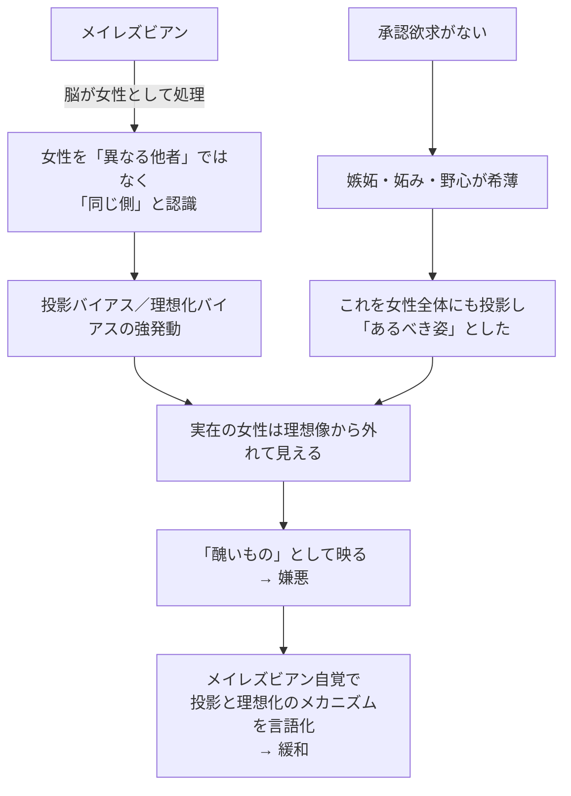

---
tags:
  - 根拠とエピソード
  - 対人関係
  - 通貨レート違い
  - 女性嫌悪
---

# 対人関係の傍証

私の特性が、対人関係の中でどう現れたかのエピソード集。承認欲求の不在、HSP、通貨レート違い、女性嫌悪などの根拠が、ここに集まる。

## SNSの「いいね」を気持ち悪いと感じた

ある時、私の意見にSNSで大量の「いいね」がついた経験がある。私の反応は：

> 気持ち悪いと感じた。私は自分の意見に対する賛否や、異なる視点からの意見を聞きたかったのであって、無言の反応を集めたかったわけではない。
> （`04-1-8_集団の中での評価に関する欲求について.md`）

多くの人は「いいね」がたくさん付くと嬉しい。承認回路が発動するからだ。私の中にはその回路がない。

私が求めていたのは：
- **議論** — 賛否や異なる視点の交換
- **整合性検証** — 自分の意見の弱点指摘
- **対話** — 双方向の認知の更新

「いいね」はこのどれでもない。**反応の単純化** であり、**議論の代替** であり、**承認回路の充足装置** だ。

これがSNSの構造的問題で、私の合理回路には適合しない。SNSが嫌いな理由は明確だ。

## 麻雀で勝ちに執着できない

私は麻雀で常に **三万点前後の二位タイプ** だった。

- 大きく勝つことも大きく負けることもない
- 安定して中庸の点数

理由は次の自己観察で分かった：

- 勝ちたい人がいると、無意識に手を抜いてしまう
- 辛そうな人がいると、無意識に手を抜いてしまう
- 結果として中庸に着地

> 自分は勝ちに執着できないタイプの人間なのだ。
> （`04-1-6_他者との比較や優越に関する欲求について.md`）

これは「優しさ」ではなく、**比較欲求 × 優越欲求の不在** が、私の中で勝ちへの執着を発動させない結果だ。

通常の人なら、麻雀のように明示的なゲームでは比較欲求が発動して、勝ちにこだわる。私はゲームの中でも比較欲求が起きない。

## 出世欲のなさ

20代から、私は **「出世して偉くなりたい」** という感覚が分からなかった。

冷静に分析すると：

- 出世 = 責任が増える
- 仮に課長になれば、責任は単純に6倍になる
- 給料は1.3倍程度
- コスパが悪い

> 出世するということは、より大きな責任を負うことを意味する。単純に考えても、責任は六倍になる。
> （`04-1-4_地位や立場に関する欲求について.md`）

通常の人にとって、出世は責任の増加だけではなく **承認の獲得** でもある。地位、肩書、部下からの尊敬、家族の誇り。これら全部が承認回路で動機を増幅する。

私の中ではこの増幅がない。**残るのは責任のコストだけ**。だから、合理判断として「出世したくない」となる。

## 22歳で「使われる側でいい」と決断

22歳の新聞販売店店長時代、私は **「自分は一生、使われる側でいい」** と意識的に決断した。

> 自分は一生、使われる側でいい。
> （`04-1-5_肩書きや称号への欲求について.md`）

これは諦めではない。**承認欲求のない人間にとっての合理的な戦略選択** だ。

- 「使う側」を目指すと、出世競争に巻き込まれる
- 承認回路で動く同僚と通貨レートが違うので、競争に勝つ動機がない
- 競争に勝てないし、勝ちたくもない
- 「使われる側」で固定する方が、合理性が高い

22歳でこの認識に到達したのは、新聞販売店店長として「使う側／使われる側」の構造を内側から見たからだ。

## 殴った相手の表情への嫌悪

中学3年で、教室で同級生に殴られた事件。相手の表情に **「満たされた」感じ** があった。

私はそれを **心底気持ち悪い** と感じた。

これは [認知的傍証](03_認知的傍証.md) でも詳述したが、対人関係の文脈では：

- 殴る・殴られるという行為は、対人関係の中で起きる
- 相手は私から「優位を取った」ことで満たされた
- 私には「優位を取られて屈辱」という感覚もなかった（比較欲求がない）
- 残ったのは「殴られた痛み」と「相手の表情への気持ち悪さ」だけ

通常の対人関係では、暴力は屈辱・恐怖・復讐心を生む。私の中ではそのいずれも起きない。承認欲求の不在がこの反応の起点にある。

## 02-5-3 給食強制場面の記憶

学校で女子がいじめられっ子（男子）に給食を強制する場面を、私は強く記憶している。

構図：
- 同調圧力（女子グループ）
- 権威の黙認（先生）
- 個人（被害者男子）

私はこの場面に **強烈な共感とともに反応した**。HSPで他者の痛みに同一化したからだ。

通常の児童は、こういう場面でも：
- 「先生が見ているから問題ない」
- 「みんながやっているから普通」
- 「自分が被害者じゃないから関係ない」

と処理する。私はそうできない。承認回路の閾値が低いから「普通の指導」に見えず、HSPで被害者の痛みが生々しく伝わる。

> 世の中の八割くらいの人はどこかおかしいのではないか、と本気で考えたこともある。
> （`02-5-3_いじめられっ子をいじめる女子.md`）

後に「8割側がおかしい」のではなく「自分が2割側」と認識を転換した。

## 女性嫌悪の構造

私には一時期、強い **女性嫌悪** があった。詳細は [派生的特性のマップ](../02_私の特性/06_派生的特性のマップ.md) で。

きっかけ：

- 大人の女性からの「一人っ子だから我儘」発言
- ドラマの嫁姑関係（意地悪、支配、見下し、陰湿さ）
- 学校で女子がいじめられっ子に給食を強制する場面
- 女性の嫉妬の空気・遠回しな攻撃
- 特定の女性タレント・フェミニスト

構造（複雑なメカニズム）：

- 私の脳は自分を女性として処理 → 女性を「同じ側」と扱う
- 承認欲求のなさを女性全体にも投影 → 「あるべき姿」とした
- 実在の女性が理想像から外れる → 醜く見える → 嫌悪

> 私は「女性そのもの」を嫌っていたのではなく、女性をめぐるさまざまな刺激が、私の中の何かを強く揺さぶり、苦痛や恐怖や反発を引き起こしていた。
> （`02-5-0_女性が嫌い.md`）

メイレズビアンの自覚後、このメカニズムが言語化されて、嫌悪は大きく緩和した。

## VRChat での20代友人との通貨違い

VRChat期、20代の友人と仲良くなったが、価値観の違いが顕著だった：

- 彼らの楽しみ：可愛いアバターで写真撮ってツイート、フォロワー数、いいね
- 私にとっての価値：知識・整合性・対等な対話
- 「Claude すごい」を伝えても、彼らは反応しない

> 為替が成立しない異国の通貨を見せられているようなもの。
> （`MyConsiderations/docs/哲学/2026-05-01_4段階目薄人間の社会的居場所.md`）

これが [通貨レート違い仮説](../06_仮説と理論/03_通貨レート違い仮説.md) の典型例だ。

## 高校友人との関係

高校時代の友人（小児麻痺、大手IT企業課長、彼の親友）との関係は40年続いている。

- FF11復帰で1年半5000時間プレイ
- ゲームを介してなら、合理通貨と承認通貨の違いを意識せずに友人関係を保てる
- だが Claude Code を伝えても響かない

ここで私は友人定義を再確認した：

> 友人は **無条件で幸せになってほしい相手**。一度成立したら、現在の交流の質と独立に固定される。

詳細は [友人とコミュニティの位置](../08_今とこれから/02_友人とコミュニティ.md)。

## アセクシャルの友人

高校時代の友人の一人は、性欲がほぼないアセクシャル（と推測される）人物だ。彼にも承認欲求が薄そうな観察がある。

> アセクシャルの友人も承認欲求がなさそう。
> （`_archive/承認欲求がない構造元データ.md`）

これは「配偶ゴール不成立 → 地位獲得本能不発動」仮説の他事例での傍証になる。性欲がない（配偶ゴールが起動しない）友人にも、承認欲求の薄さが観察される。これは仮説の一般性を支える。

## 整合性の観点

これらの対人関係の傍証は、独立した体験だ：

- SNSの「いいね」（21世紀以降の現象）
- 麻雀（個人の継続的な傾向）
- 出世欲のなさ（職場での観察）
- 22歳の決断（社会観の確立）
- 中3の殴られた事件（小さい頃の単発体験）
- 給食強制場面（HSPの傍証）
- 女性嫌悪と緩和（時間経過による変化）
- VRChat友人との違い（最近の現象）
- 高校友人との40年（長期持続）
- アセクシャル友人の観察（他者事例）

これらが「承認欲求の不在 × 配偶ゴール不成立 × HSP」という3つの特性で一斉に説明できる。これが私の自己理解の確からしさの根拠だ。

## 関連ページ

- [承認欲求がない構造](../02_私の特性/03_承認欲求がない構造.md)
- [メイレズビアン](../02_私の特性/02_メイレズビアン.md)
- [HSP的感受性](../02_私の特性/04_HSP的感受性.md)
- [通貨レート違い仮説](../06_仮説と理論/03_通貨レート違い仮説.md)
- [37-47歳 コミュニティの試行と離脱](../04_ライフヒストリー/05_37-47歳_コミュニティの試行と離脱.md)
