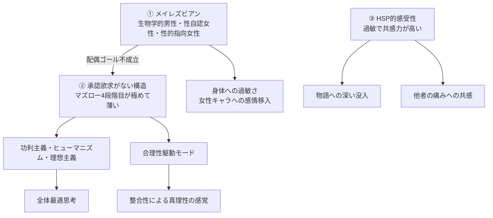

# 00_設計サマリー — SelfAnalysis 体系化設計の入口

> 本書は SelfAnalysis プロジェクトを **「私という人間 hoehoe を完全分解し、多面的に再構成する」** ためのアーキテクチャ設計書群（_design/）の入口である。
> 全体を一望し、どの設計書をどの順で読めばよいかを示す。

---

## 0. このプロジェクトの目的（再確認）

47歳になって自分を理解した本人 hoehoe の自己分析を、

1. **完全に分解できるぐらいしっかり体系化する**
2. **いろいろな方面から見れるようにする**

この二つを両立させることが、本設計書群の到達点である。

そのために、本人の素材（MyEssay、MyConsiderations、対話ログ、簡易年表など）を atomic な単位に分解し、視点別の「ビュー」として再構成する3層アーキテクチャを採用する。

### 学術的な系譜

このアーキテクチャは独立に発明したものではなく、**既存の確立された手法を自己分析という用途に組み合わせ直したもの**である。
- **データ層**：ツェッテルカステン（Luhmann）＋ データベース正規化理論
- **抽出手法**：グラウンデッド・セオリー（Glaser & Strauss）
- **ビュー層**：ナラティブ・アイデンティティ理論（McAdams）＋ イディオグラフィック研究（Allport）
- **タグ層**：ファセット分類法（Ranganathan）
- **オーケストレーション**：マルチエージェント・システム（Claude Subagents 機能）

12 atom タイプの取り合わせ自体は本プロジェクトのオリジナル。
詳細：[02_アーキテクチャ全体像.md](02_アーキテクチャ全体像.md) の §0.5

---

## 1. 設計書の構成

```
_design/
├── 00_設計サマリー.md              ← このファイル（全体の入口）
├── 01_現状診断.md                  ← なぜ今のままでは破綻するか
├── 02_アーキテクチャ全体像.md      ← 3層構造の全体図
├── 03_データ層スキーマ仕様.md      ← 12タイプの atom の詳細
├── 04_ビュー層カタログ.md          ← 7軸のビュー設計
├── 05_オーケストレーション運用設計.md ← エージェント役割分担
├── 06_移行計画.md                  ← Phase 0〜8 の移行手順
└── 07_運用ルール.md                ← 日々の追記とメンテナンス
```

---

## 2. 30秒で理解する設計の核

### 2.1. 何が問題だったか

SelfAnalysis フォルダは、執筆を続けるうちに **整理軸が二重化**してしまっていた。
当初の「目的別」8章構成（自己紹介／私の特性／…）に加え、後から「特性別」3章（性同一性障害／HSP／承認欲求）が増設され、両者が並走している。
さらに `エピソード/` というフラットな素材集が独立に存在し、章ページとの関係が定義されていない。

結果、**同じ事実があちこちに分散**し、書き手は「どこに何を書けばよいか」を毎回判断するコストに消耗していた。

詳細：[01_現状診断.md](01_現状診断.md)

### 2.2. どう解決するか

**データ層・ビュー層・タグ層の3層に分離**する。

- **データ層**：「私」を構成する atomic な要素の正本（一つの事実は一箇所にだけ書く）
- **ビュー層**：データ層を視点別に束ね直した読み物（参照とナラティブのみ、本文を持たない）
- **タグ層**：データ層に貼られる横断インデックス（自動生成される）

これによって、

- 同じ事実を複数のビューが参照しても重複しない
- ビューはいくらでも増やせる（多面性）
- 新しい気づきはまずデータ層に atom として登録するだけ（書き場所の判断コスト消滅）

詳細：[02_アーキテクチャ全体像.md](02_アーキテクチャ全体像.md)

### 2.3. データ層の atom 12タイプ

```
EP（Episode）   一回の出来事
CL（Claim）     私が抱く命題
HY（Hypothesis） 自家製仮説
CO（Concept）   独自用語・造語
VL（Value）     価値観
FA（Fact）      履歴書相当の事実
PP（Person）    関係者
TP（Period）    人生の時期
TH（Theory）    外部理論
IN（Influence） 影響源
RP（Reaction）  反応パターン
BP（Behavior）  行動パターン
```

詳細：[03_データ層スキーマ仕様.md](03_データ層スキーマ仕様.md)

### 2.4. ビュー層の 7 軸

```
主題別   メイレズビアン／HSP／承認欲求／合理性駆動／ヒューマニズム／創作／社会観／女性観
時系列   9年×2サイクル／簡易年表／ライフフェーズ別伝記
抽象度別 全エピソード索引／全主張カタログ／全仮説マップ／用語集／価値観体系
関係別   私と社会／私と他者／私と自分／私と身体／私と物語／私とAI／私と性／私と母
用途別   履歴書／初対面用／同類への手紙／AI引き継ぎ／学術／創作素材／note発信
信頼度別 確信していること／仮説の段階／まだわからないこと
入口別   性同一性／思想／キャリア／趣味／うつ病・崩壊／AI活用
```

詳細：[04_ビュー層カタログ.md](04_ビュー層カタログ.md)

### 2.5. オーケストレーション

体系化を一人（一エージェント）でやらず、専門エージェントに分担させる。

- **設計エージェント**：設計書の起草・改訂
- **抽出グループ**：12タイプそれぞれに専門の抽出エージェント
- **整合エージェント**：重複・矛盾検出、双方向参照の整合
- **ビューエージェント**：視点別の読み物を編成
- **検証エージェント**：形式・参照の機械検証
- **オーケストレーター（人間 hoehoe + 監督）**：最終判断、機微情報の方針

詳細：[05_オーケストレーション運用設計.md](05_オーケストレーション運用設計.md)

### 2.6. 移行計画

```
Phase 0：準備（設計書承認、退避先作成）
Phase 1：データ層スケルトン（パイロット atom 各タイプ1〜2件）
Phase 2：既存 EP-001〜042 を新スキーマに昇格
Phase 3：他 11タイプの atom 抽出
Phase 4：整合と検証
Phase 5：最小10ビュー構築
Phase 6：旧構造の整理
Phase 7：拡充10ビュー
Phase 8：運用本格化
```

想定全体期間：2〜4ヶ月

詳細：[06_移行計画.md](06_移行計画.md)

### 2.7. 運用ルール

- 新しい気づきは **必ずデータ層の atom として登録**
- ビューは遅れて追従、本文は持たない
- 月次レビュー（1〜2時間）で整合性を保つ
- 年次レビューで構造を再点検

詳細：[07_運用ルール.md](07_運用ルール.md)

---

## 3. このプロジェクトで扱う「私」の三つの生得的特性

設計のすべてが、本人の自己理解の中核にある**三つの生得的特性**を中心に組み立てられている。
これらは「強み」「特技」ではなく、**生得的にこの体質を持って生まれたがゆえに現状こうなってしまった**という、構造的な制約・出発点として扱う。



データ層・ビュー層のあらゆる atom が、この三つの生得的特性のどこかにつながっている。

---

## 4. 読む順序

### 4.1. はじめての人（本人 hoehoe を含む）

1. **00_設計サマリー** ← 今ここ
2. **01_現状診断** — なぜ作り直すのか
3. **02_アーキテクチャ全体像** — 大枠の理解
4. **03_データ層スキーマ仕様** — 詳細を見たい人向け
5. **04_ビュー層カタログ** — 多面性をどう作るか

### 4.2. 実装に入る人（抽出エージェント等）

1. **02_アーキテクチャ全体像** — 全体構造の把握
2. **03_データ層スキーマ仕様** — 自分が扱うタイプの仕様を熟読
3. **05_オーケストレーション運用設計** — 自分の役割
4. **06_移行計画** — 自分が担当するフェーズ
5. **07_運用ルール** — 守るべき規約

### 4.3. 運用中にトラブルが起きた人

1. **07_運用ルール** §10「緊急対応」
2. **06_移行計画** §15「ロールバック方針」
3. 必要なら **02_アーキテクチャ全体像** で原則に戻る

---

## 5. このプロジェクトが完成したときの姿

完成形では次が実現される。

### 5.1. 完全分解

- 「私」を構成する atom が **数百〜千件** の規模で正本として存在
- 各 atom は永続 ID で識別され、相互参照されている
- 重複なし、矛盾なし、参照整合あり

### 5.2. 多面ビュー

- **30前後のビュー** が異なる視点から「私」を描く
- 同じ atom が複数のビューに登場し、見え方が変わる
- 入口が複数ある（性同一性／思想／キャリア／趣味／…）ため、どんな読者も自分の関心から入れる

### 5.3. 持続可能な運用

- 新しい気づきは数分で atom として登録できる
- 機械検証が形式の崩れを防ぐ
- 月次レビューで整合性が保たれる
- AI に引き継ぐときも構造が崩れない

### 5.4. 多様な用途

- 履歴書として
- 初対面の自己紹介として
- 同類少数派への手紙として
- Claude/ChatGPT への引き継ぎ資料として
- 創作プロジェクト（AMABレズビアン主人公のファンタジー）の素材として
- YouTube・note の発信素材として
- 学術研究への参照として

すべてが同じデータ層の上に立ち上がる。

---

## 6. 設計書の現在地

| 設計書 | 状態 | 最終更新 |
| --- | --- | --- |
| 00_設計サマリー | ドラフト初版 | 2026-05-08 |
| 01_現状診断 | ドラフト初版 | 2026-05-08 |
| 02_アーキテクチャ全体像 | ドラフト初版 | 2026-05-08 |
| 03_データ層スキーマ仕様 | ドラフト初版 | 2026-05-08 |
| 04_ビュー層カタログ | ドラフト初版 | 2026-05-08 |
| 05_オーケストレーション運用設計 | ドラフト初版 | 2026-05-08 |
| 06_移行計画 | ドラフト初版 | 2026-05-08 |
| 07_運用ルール | ドラフト初版 | 2026-05-08 |

すべて初版。本人 hoehoe の承認を得て、改訂を重ねていく。

---

## 7. 用語集（このフォルダで使う略語）

| 略語 | 意味 |
| --- | --- |
| atom | データ層の最小単位（EP / CL / HY / CO / VL / FA / PP / TP / TH / IN / RP / BP の総称） |
| EP | Episode — 一回の出来事 |
| CL | Claim — 命題 |
| HY | Hypothesis — 自家製仮説 |
| CO | Concept — 独自用語 |
| VL | Value — 価値観 |
| FA | Fact — 客観事実 |
| PP | Person — 関係者 |
| TP | Period — 人生の時期 |
| TH | Theory — 外部理論 |
| IN | Influence — 影響源 |
| RP | Reaction — 反応パターン |
| BP | Behavior — 行動パターン |
| ビュー | データ層を視点別に束ねた読み物 |
| 軸 | ビューを分類する切り口（主題別／時系列／…） |
| 三つの生得的特性 | メイレズビアン／HSP／承認欲求の不在 の三つ。「強み」ではなく構造的な出発点 |

---

## 8. このプロジェクトの哲学

設計のすべては次の信念に立っている。

> **「私」は単一の物語では語り切れない。だが atomic な事実を多面から束ね直せば、その都度違う「私」が立ち上がる。それが私を理解するということだ。**

47年間アイデンティティが不明確だった本人が、47歳で自分を理解した。
その理解は **一つの物語** ではなく、**複数の角度から見えた整合的な像** である。
だからこのプロジェクトも、単一の「正史」を書こうとしない。
データ層に正本を置き、ビュー層に多面性を置く。

---

## 9. このサマリーを更新するタイミング

- 設計書 01〜07 のいずれかに大きな改訂が入ったとき
- 月次レビューでサマリーと実体がズレていることを発見したとき
- 年次レビュー時

---

*作成日: 2026-05-08 / 著者：設計エージェント（Claude） / 採否判定：本人 hoehoe 待ち*
