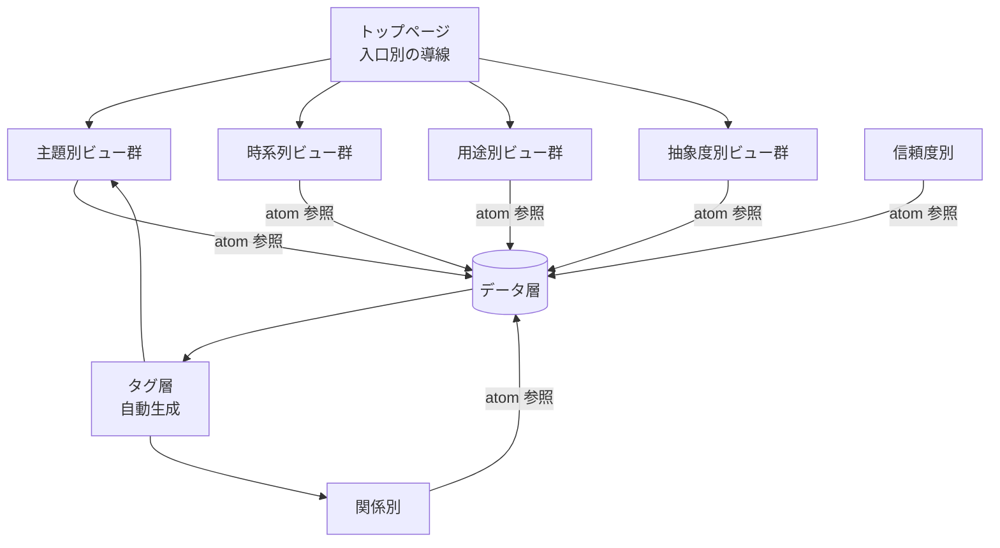

# 04_ビュー層カタログ — 多面的な見え方を定義する

> 本書はビュー層に存在しうる**ビューの種類**を網羅的にカタログ化する。
> ビューは「データ層を、ある一つの視点で束ね直した読み物」である。
> ビューはいくらでも増設できる。本書はあくまで**初期に必要な最小セット**を定義する。

---

## 0. ビュー層の運用原則（再掲）

- ビューは**データ層への参照と、視点別の解説**でできている
- ビューは**本文を持たない**。全ての一次情報はデータ層にある
- ビューは増えても**データ層を変更しない**
- 同じ atom が**複数のビューに登場してよい**
- ビューには**目的・想定読者・読了時間・最終更新日**を必ず明示する

---

## 1. ビューの7軸（再掲）

| 軸 | 説明 |
| --- | --- |
| 主題別 | テーマ・トピックで束ねる |
| 時系列 | 時間軸で束ねる |
| 抽象度別 | データタイプ別に俯瞰する |
| 関係別 | 「私と何か」の関係軸で束ねる |
| 用途別 | 読まれ方の用途で束ねる |
| 信頼度別 | 確信レベルで束ねる |
| 入口別 | 初見の読者の興味から入る |

各軸ごとに必要なビューを以下で詳細化する。

---

## 2. 主題別ビュー

### 2.1. メイレズビアンレンズ

- **目的**：性同一性に関連する全ての atom を一望する
- **想定読者**：当事者、同類、性同一性に関心のある研究者
- **読了時間**：15-20分
- **構成要素**：
  - 関連 CO（メイレズビアン、AMABレズビアン）
  - 関連 CL（性自認・性的指向についての主張群）
  - 関連 EP（身体・服装・嗜好に関するエピソード群）
  - 関連 RP / BP（女性キャラ選択、銭湯への違和感など）
  - 関連 HY（配偶動機-地位獲得本能の連動仮説）

### 2.2. HSPレンズ

- **目的**：感受性の高さに関する atom を一望する
- **想定読者**：HSP当事者、対人援助職
- **構成要素**：
  - 関連 TH（HSP の理論）
  - 関連 EP（過敏な反応のエピソード群）
  - 関連 RP（刺激への反応パターン）
  - HSP特有の派生（物語没入、共感の強さ、刺激回避）

### 2.3. 承認欲求レンズ

- **目的**：マズロー4段階目の不在を全て一望する
- **想定読者**：心理学に関心ある読者、同類少数派
- **構成要素**：
  - 関連 CL（承認欲求の不在に関する主張）
  - 関連 EP（マズロー10項目の検証エピソード群）
  - 関連 HY（配偶動機-地位獲得本能の連動仮説）
  - 関連 CO（4段階目薄人間）

### 2.4. 合理性駆動レンズ

- **目的**：合理性・整合性で世界を判定するモードに関する atom
- **構成要素**：
  - 関連 VL（合理性、整合性、全体最適）
  - 関連 CO（合理性駆動モード、整合性による真理性の感覚）
  - 関連 IN（系譜的人物：スピノザ・ヴィトゲンシュタイン・メンデル・マスク・落合・堀江）
  - 関連 EP（合理的判定で社会と摩擦が起きたエピソード）

### 2.5. ヒューマニズムレンズ

- **目的**：人間の尊厳・公正さへの志向を一望
- **構成要素**：
  - 関連 VL（ヒューマニズム、公正さ）
  - 関連 EP（弱者を見たときの反応、いじめへの嫌悪）
  - 関連 CL（マザー・テレサのように生きるべきだと本気で思っていた等）

### 2.6. 創作・物語レンズ

- **目的**：アニメ・小説・創作活動への関心を一望
- **構成要素**：
  - 関連 IN（作品の遍歴）
  - 関連 EP（物語経験のエピソード）
  - 関連 RP（女性キャラへの感情移入）
  - 関連 CL（自分専用生成システム）

### 2.7. 社会観レンズ

- **目的**：社会・組織・他者観を一望
- **構成要素**：
  - 関連 EP（働かない人への憤り、フェミニストへの嫌悪、社会主義への共感など）
  - 関連 CL（社会についての主張群）
  - 関連 HY（通貨レート違い仮説）

### 2.8. 女性観レンズ（特殊枠）

- **目的**：「女性が嫌い」と「女性に感情移入する」という矛盾の構造を一望
- **想定読者**：本人自身の整理、当事者
- **取扱注意**：誤解を招きやすいので、ビュー冒頭に注釈を必ず置く

---

## 3. 時系列ビュー

### 3.1. 9年×2サイクル伝記

- **目的**：本人の自家製仮説に沿って人生を語る
- **構成要素**：TP-002（社交獲得期 15-24）と TP-004（離脱期 28-37）の対称構造を中心に
- **特徴**：仮説と伝記を融合させた語り

### 3.2. 簡易年表（履歴書版）

- **目的**：採用担当・初対面の人向けに事実だけを並べる
- **構成要素**：FA を時系列に並べたもの
- **読了時間**：3分

### 3.3. ライフフェーズ別伝記

- **目的**：時期ごとに節を分けて、TP-000 から TP-006 まで通読できるように
- **構成要素**：各 TP を順に展開、key_episodes を物語として接続

### 3.4. 自己理解の発展史

- **目的**：「何歳のときに何に気づいたか」を時系列で
- **構成要素**：CL の created を軸に、自己理解の発展を追う

---

## 4. 抽象度別ビュー

### 4.1. 全エピソード索引

- **目的**：データ層の全 EP を一覧で参照できる
- **構成要素**：EP の自動生成リスト（タイトル + age_range + 関連特性）
- **生成方法**：`hooks/generate_index.py` で自動

### 4.2. 全主張カタログ

- **目的**：本人が抱く全ての CL を一覧
- **構成要素**：CL の自動生成リスト
- **特徴**：confidence 順に並べる（確信→仮説→推測）

### 4.3. 全仮説マップ

- **目的**：自家製仮説 HY の全体図
- **構成要素**：HY 一覧 + Mermaid で仮説間の関係を可視化

### 4.4. 用語集（全 CO 索引）

- **目的**：本人が使う独自用語を辞書として
- **構成要素**：CO の五十音順索引

### 4.5. 価値観体系

- **目的**：VL の階層構造を可視化
- **構成要素**：VL の priority と関係性を Mermaid で

---

## 5. 関係別ビュー

### 5.1. 私と社会

- **目的**：社会との関わり方の歴史と現在
- **構成要素**：職歴 FA、社会的摩擦の EP、社会観の CL、HY-003（通貨レート違い）

### 5.2. 私と他者

- **目的**：個別の他者との関係パターン
- **構成要素**：PP、対人摩擦の EP、対人観の CL

### 5.3. 私と自分

- **目的**：自己関係（自己評価、自己理解の歴史）
- **構成要素**：自己評価の CL（「自分を完全にダメ人間だと思っていた」など）、自己理解の発展

### 5.4. 私と身体

- **目的**：身体感覚との関係（メイレズビアンの身体違和感、HSPの過敏さ）
- **構成要素**：身体に関する EP / RP / CL

### 5.5. 私と物語

- **目的**：物語との関わり方（没入、創作、自分専用生成システム）
- **構成要素**：IN、EP（物語体験）、CL、創作プロジェクトの記述

### 5.6. 私とAI

- **目的**：AI との関係（ChatGPT/Claude、自分専用生成システム、対話ログ）
- **構成要素**：AI使用の EP、AI 関連 CL、IN（特定対話）、創作プロジェクト
- **更新頻度**：高（月次推奨）

### 5.7. 私と性

- **目的**：性自認・性的指向・性についての全体像
- **構成要素**：メイレズビアンレンズと重複する atom + 性的経験・嗜好の追加情報

### 5.8. 私と母

- **目的**：母との関係を独立に整理
- **構成要素**：PP-001（母）、関連 EP、母から受けた影響に関する CL

---

## 6. 用途別ビュー

### 6.1. 履歴書ビュー

- **目的**：採用担当・取引相手向け
- **想定読者**：人事担当、初対面のビジネス相手
- **構成要素**：FA 全部 + 時系列の職歴 + スキル一覧
- **特徴**：機微情報は簡略化（公開範囲を制御するモード）

### 6.2. 初対面用自己紹介ビュー

- **目的**：友人・知人候補に渡す自己紹介
- **構成要素**：エレベーターピッチ + 三つの生得的特性の概要 + 趣味
- **読了時間**：5分

### 6.3. 同類への手紙

- **目的**：4段階目薄人間や AMABレズビアンの当事者向け
- **構成要素**：「自分はこうだった、あなたはどうですか」型の語り
- **特徴**：体験記中心、理論薄め

### 6.4. AI引き継ぎビュー

- **目的**：Claude/ChatGPT に最初に読ませる人物像
- **構成要素**：CLAUDE.md の拡張版 + 重要キーワード辞書 + 三つの生得的特性 + 主要HYのワンライナー集
- **形式**：機械可読性重視

### 6.5. 学術研究者向けビュー

- **目的**：心理学・ジェンダー研究者向け
- **構成要素**：HY 全部 + 関連 TH + サンプル数1の留保

### 6.6. 創作素材ビュー

- **目的**：本人がライトノベル等を作るときの素材として
- **構成要素**：人物像・世界観の設定として使える atom 群

### 6.7. note / SNS発信ビュー

- **目的**：YouTube や note などの発信媒体向け
- **構成要素**：核となる主張のいくつかを切り出した短文集

---

## 7. 信頼度別ビュー

### 7.1. 確信していること

- **目的**：「これは間違いなく自分のことだ」と確信している命題群
- **構成要素**：confidence: 確信 の CL を集めたもの

### 7.2. 仮説の段階

- **目的**：説明仮説として提示しているが反証可能なもの
- **構成要素**：HY 全部 + confidence: 仮説 の CL

### 7.3. まだわからないこと

- **目的**：保留中・未決着の問い
- **構成要素**：confidence: 推測 / 保留 の CL、TASKS の「開いている問い」

---

## 8. 入口別ビュー

初見の読者がそれぞれの興味から入れるように、複数の入口を用意する。

### 8.1. 性同一性から入る

- 「47歳でメイレズビアンと気づいた話」を最初に読ませる
- そこから三つの生得的特性→ライフヒストリーへ

### 8.2. 思想から入る

- 合理性駆動モードと整合性による真理性の感覚から導入
- 系譜（スピノザ→マスク→落合）を経由して本人へ

### 8.3. キャリアから入る

- 履歴書ビュー → 9年×2サイクル → 戦略的撤退

### 8.4. 趣味から入る

- アニメ遍歴 → 自分専用生成システム → 創作プロジェクト

### 8.5. うつ病・精神的崩壊から入る

- 倉庫の裏で泣いた → 承認欲求の不在 → 自己理解への到達
- **取扱注意**：自殺念慮を持つ読者の自己投影を誘発しうる。冒頭注釈必須

### 8.6. AI活用から入る

- AI との対話ログから生まれた気づき → 自分専用生成システム
- 「Claude をどう使っているか」が初見にとっての入口になる

---

## 9. ビュー横断の入口（トップページ）

`docs/index.md`（サイトのトップ）は、**入口別ビューへの導線**を兼ねる。

```markdown
# 私という人間

（エレベーターピッチ）

## どこから読みますか
- 性同一性から入る → [メイレズビアンレンズ](views/主題別/メイレズビアンレンズ.md)
- 思想から入る → [合理性駆動レンズ](views/主題別/合理性駆動レンズ.md)
- キャリアから入る → [履歴書ビュー](views/用途別/履歴書ビュー.md)
- ...

## 体系的に読みたい人へ
1. [自己紹介](views/用途別/初対面用自己紹介ビュー.md)
2. [三つの生得的特性](views/主題別/メイレズビアンレンズ.md) → [HSPレンズ](...) → [承認欲求レンズ](...)
3. [9年×2サイクル伝記](views/時系列/9年2サイクル.md)
4. [仮説と理論](views/抽象度別/全仮説マップ.md)

## 索引で探す
- [全エピソード索引](views/抽象度別/全エピソード索引.md)
- [全主張カタログ](views/抽象度別/全主張カタログ.md)
- [用語集](views/抽象度別/用語集.md)
- [タグ一覧](tags.md)
```

---

## 10. ビュー間の関係マップ



---

## 11. 初期実装で作る最小ビューセット

すべてのビューを一気に作るのは現実的ではない。**初期に作るべき最小セット**を以下に定める。残りは後続フェーズで増やす。

### Phase A — 初期最小セット（10ビュー）

1. メイレズビアンレンズ（主題別）
2. HSPレンズ（主題別）
3. 承認欲求レンズ（主題別）
4. 合理性駆動レンズ（主題別）
5. 9年×2サイクル伝記（時系列）
6. 簡易年表（時系列）
7. 全エピソード索引（抽象度別、自動生成）
8. 履歴書ビュー（用途別）
9. AI引き継ぎビュー（用途別）
10. トップページ（入口別の導線）

### Phase B — 拡充セット（さらに10ビュー）

11. ヒューマニズムレンズ
12. 創作・物語レンズ
13. 社会観レンズ
14. ライフフェーズ別伝記
15. 全主張カタログ
16. 全仮説マップ
17. 価値観体系
18. 私と社会
19. 私と他者
20. 私と AI

### Phase C — 完成セット（残り）

残りのビュー全部 + 必要に応じて新規ビューを追加。

---

## 12. ビューの追加ルール

新しいビューを追加するとき、次を満たすこと。

1. 既存のビューと**目的が被らない**こと（被るなら統合する）
2. 想定読者と読了時間を**事前に決めておく**こと
3. 新規 atom を追加することなく既存 atom の参照だけで構成できること
4. 不足を発見したら、データ層に atom を追加してからビューを書くこと（ビュー側で本文を書かない）

---

*作成日: 2026-05-08 / 想定ビュー数：初期10、最終 30+ 程度 / 後続書類：05_オーケストレーション運用設計.md*
