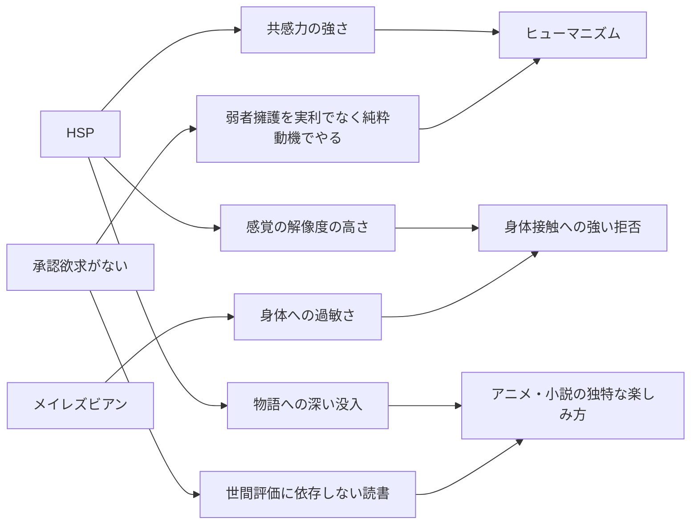

---
tags:
  - 私の特性
  - HSP
  - 感受性
---

# HSP的感受性

私は **HSP（Highly Sensitive Person）** に近い感受性を持っている。三本柱の第三の柱だ。

ただし、この章は他の二本（メイレズビアン、承認欲求の不在）と比べると、検証密度が現時点では低い。承認欲求10項目の自己照合のような体系的な検証はまだしていない（→ [TASKS](https://github.com/annachloe2025/SelfAnalysis/blob/main/TASKS.md) に記載）。

## HSP の四特徴とのチェック

HSP の特徴として一般によく挙げられる4項目（Aron による DOES）と私の自己照合：

| 特徴 | 一般的説明 | 私の状態 |
| --- | --- | --- |
| **D**epth of processing | 情報を深く処理する | DNA検査で「情報処理がやや遅い傾向」と判明。表面で済ませず構造まで掘る |
| **O**verstimulation | 刺激に圧倒されやすい | 銭湯・温泉、人混み、長時間の対面、騒音への耐性が低い |
| **E**motional reactivity & Empathy | 感情反応が強く、共感が高い | 物語に過度に没入する、不当な扱いを目撃したときの動揺が長引く、いじめ場面の被害者に強く同一化する、他者の痛みへの反応が強い |
| **S**ensing the subtle | 微細な刺激への感受性 | 非言語的手がかり、声のトーン、空気の変化、わずかな違いに気づきやすい。整合性違反の検出感度の高さもこれに含まれる |

すべての項目に当てはまっている自覚がある。

## 私のHSP的反応の代表例

### アニメ・小説への過度な没入

中学で国語克服のために読み始めたライトノベルから、私の物語没入は止まらなくなった。

- 高校終わり頃のエヴァンゲリオンで「アニメをアニメとして見る」段階を超えた
- 専門学校時代に森博嗣・京極夏彦に進出
- 20代後半〜30代のうつ病期にアニメ視聴量が爆発
- 46歳でオーディブルを発見し、ライトノベルを200冊以上消費（[面白さの5仮説](../06_仮説と理論/05_面白さの5仮説.md)）

私の没入度は「制作者のように見ている」と表現したくなるレベルで、作画の挙動・カット構成・キャラの動機の整合性などまで意識下で追っている。

### 他者の痛みへの反応

- 02-5-3 のいじめ場面（給食を強制される男子）への共感が強烈で、構造を「同調圧力 × 権威 × 個人」の社会の縮図として捉え続けた
- 戦争映画・反戦アニメ（『火垂るの墓』を毎年お盆に見せられた世代）の影響が長く残った
- 街中で困っている人を見かけると、その後数時間〜数日その情景がループする

### 刺激への過敏さ

- 銭湯・温泉が苦手（皮膚への過敏さも含む）
- 自分にとって不快なテレビ出演者は無意識にチャンネルを変えてしまう
- 化学物質・空気質への感度が高い（→ MyConsiderations の [室内ウォーキングと空気質](https://annachloe2025.github.io/MyConsiderations/健康/2026-04-14_室内ウォーキングと空気質/)）
- 31歳の市場勤務（朝3時〜夕方6時、隔週休2日）で重うつになったのは、刺激量と社会的ストレスの両方が閾値を超えたから

### ファントムセンス

VRChat 期にファントムセンス（VR内でポリゴンに触れたときに皮膚が温かく感じる、匂いを感じるなど、現実の感覚が立ち上がる現象）を強く体験した。これは没入能力 × 感覚の解像度の高さで生じる現象で、HSP的特性と整合している。

### transportation能力の高さ

物語空間に身体ごと持っていかれる能力（心理学でいう transportation）が高い。これが「自分専用ライトノベル生成システム」構想の前提になっている。私自身が transportation 能力が高いから、テキストから世界を作り出す体験そのものを資産として運用できる。

## HSPと他の二本柱の連動

HSPは単独では「感受性が強い」だけだが、他の二本柱と組み合わさることで、私の独特な動き方を作る。

## HSP の社会的不利

HSP は刺激への過敏さゆえに、社会の標準的な労働環境に適応しにくい。私が3度の決定的破綻（28歳の軽うつ、31歳の倉庫の裏、34-36歳の運送業3連続）を経験したのは、HSPと承認欲求のなさが同時に効いた結果だ。

承認欲求がある人なら、HSP的に苦しい職場でも「皆に認められたい」「家族を守るため」という承認回路で耐えられる。私にはその回路がないので、苦痛の総量が直接限界まで蓄積し、ある時点でブロックされる。

## HSPと開放性の組み合わせ

DNA検査で **「開放性が高い」** ことも判明している。HSP × 開放性 × 承認欲求のなさ、という三重の組み合わせは、人口の何パーセントぐらいに存在するのか、という問いは [TASKS](https://github.com/annachloe2025/SelfAnalysis/blob/main/TASKS.md) の開いている問いに残してある。

経験上、この組み合わせは [4段階目薄人間](05_4段階目薄人間.md) の章で論じる「横断的知性／中級どまり問題」を生む。一つの分野に閉じず複数の領域を行き来する代わりに、どの領域でも上級まで行けない。

## 関連ページ

- [三本柱](01_三本柱.md)
- [4段階目薄人間](05_4段階目薄人間.md)
- [面白さの5仮説](../06_仮説と理論/05_面白さの5仮説.md) — HSP的没入の構造化
- [現在の生活](../08_今とこれから/01_現在の生活.md)

## 