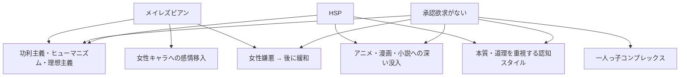
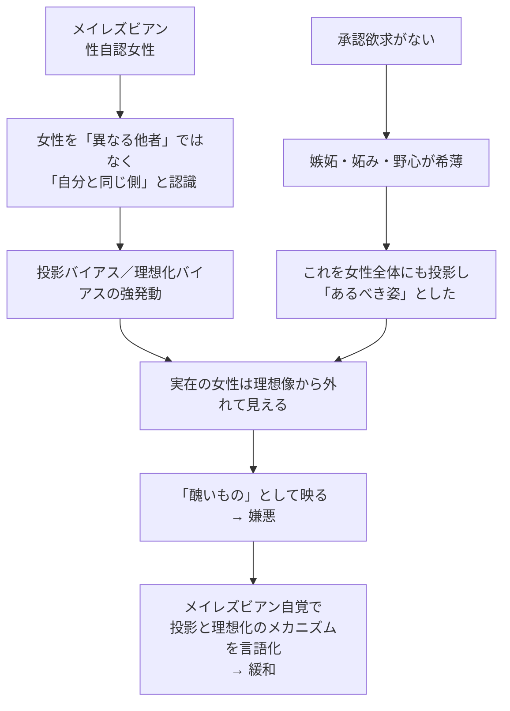

---
tags:
  - 私の特性
  - 派生特性
---

# 派生的特性のマップ

私の派生的特性（思想、嗜好、対人パターン）は、すべて[三本柱](01_三本柱.md)から導出できる。このページは、エッセイ原本の第2章「自分の特性」で挙げられている6つの派生特性を、三本柱への因果と共に俯瞰する。

## マップ全体

## 派生1：功利主義者・ヒューマニスト・理想主義者

詳細は [私の考え方 / 価値観の体系](../03_私の考え方/01_価値観の体系.md) と [世界観と人間観](../03_私の考え方/03_世界観と人間観.md) で展開する。

要点：
- 小学生時にマザー・テレサを尊敬していた
- 信条は「会話は有益であるべき」「最大多数の最大幸福」
- 20代までは皆同じ価値観だと思っていた
- 40歳近くで違いに気づき、47歳で承認欲求の欠如に気づいて全体が腑に落ちた

因果：
- **承認欲求がない** ので、本能ではなく理屈で人生指針を組み立てる必要があった → 功利主義的な「全体の幸福の最大化」に行き着いた
- **HSP** で他者の痛みに反応する → ヒューマニズム
- **承認欲求がない** ので、誰もが承認欲求を捨てれば理想社会は実現可能と感じる → 理想主義

> 普通の人が持つような「自分の内側から湧き出る人生の目的」が、私にはなかった。理屈を拠り所にするしかなかった。
> （`02-1-1_私が功利主義になる理由.md`）

> 承認欲求が前提にないと、理想的な社会は比較的簡単に実現できそうに見えてしまう。
> （`02-1-3_私が理想主義者になってしまう理由.md`）

## 派生2：アニメ・漫画・小説への深い没入

詳細は [作品と趣味 / アニメ・漫画・小説の遍歴](../07_作品と趣味/01_アニメ漫画小説の遍歴.md) で展開する。

要点：
- 中学で『スレイヤーズ』『燃える瞳のメル』から本格化
- 高校終わり頃のエヴァンゲリオンで没入が深化
- 専門学校時代に森博嗣・京極夏彦
- 20代後半〜30代のうつ病期にアニメ視聴量が爆発
- 46歳でオーディブルを発見、200冊以上のライトノベルを消費

因果：
- **HSP** の transportation 能力 → 物語空間に深く入る
- **承認欲求がない** ので、世間評価に左右されない読書 → 自分のツボに正直に作品を選ぶ
- 「制作者のように見る」癖 → メンタルモデリングへの興味（[創作論](../03_私の考え方/05_創作論.md)）

> ややアニメ制作者のようにアニメを楽しむ傾向がある。
> （`02-2-2_私がアニメなどが好きな理由.md`）

## 派生3：女性キャラへの感情移入

詳細は [メイレズビアン](02_メイレズビアン.md) と [作品と趣味](../07_作品と趣味/01_アニメ漫画小説の遍歴.md) で。

要点：
- 高校時代の格闘ゲームから一貫して女性キャラを選び続けた
- 物語の主人公にも女性主人公を好む（『スレイヤーズ』『燃える瞳のメル』も女性主人公作）
- メイレズビアン自覚後、この傾向の理由が明確になった

因果：
- **メイレズビアン** で性自認女性 → 女性キャラに自分を重ねるのが自然
- **メイレズビアン** で性的指向女性 → 女性キャラを好きでいる視線も同時にある（同一化と欲望の対象が同居）

## 派生4：物事の本質・道理を重視する認知スタイル

詳細は [思考フレーム](../03_私の考え方/02_思考フレーム.md) で展開する。

要点：
- 丸暗記より道理理解を優先
- 「なぜそれが重要なのか」が腑に落ちないと動けない
- 20歳頃からDMN（デフォルトモードネットワーク）が常時稼働している自覚
- これがうつ病・便秘症の一因にもなった

因果：
- **DNA検査で開放性が高い** ことが判明 → 多角的な解釈を好む
- **HSP** で情報を深く処理する → 表面で済ませず構造まで掘る
- **承認欲求がない** ので「みんながそう言っている」では納得できない → 自分で道理を構築する必要がある

> 起きている間はずっと何かを考えている感覚がある。
> （`02-4_物事の本質や物事の道理が大事だと思っている.md`）

## 派生5：女性嫌悪（一時期）

詳細は [対人関係の傍証](../05_根拠とエピソード/04_対人関係の傍証.md) で展開する。

要点：
- 大人の女性からの「一人っ子だから我儘」発言、嫁姑関係、いじめ場面の女子の振る舞い、女性の嫉妬、特定の女性タレント・フェミニストへの嫌悪
- 「女性そのもの」を嫌っていたのではなく、女性をめぐる刺激が自分の中の何かを揺さぶっていた、という再定義に至った
- メイレズビアン自覚後、嫌悪は大きく緩和

因果（複雑）：

> 私は「女性そのもの」を嫌っていたのではなく、女性をめぐるさまざまな刺激が、私の中の何かを強く揺さぶり、苦痛や恐怖や反発を引き起こしていた。
> （`02-5-0_女性が嫌い.md`）

> 嫉妬の感情がないと、嫉妬している相手の姿がひどく醜悪に見えてしまう。
> （`02-5-4_嫉妬の感情がない.md`）

## 派生6：一人っ子コンプレックス

要点：
- 大人の女性からの「一人っ子だから我儘」発言で、過度に自分を抑圧するようになった
- 「我儘と思われたくない」という外的ラベルを内面化し、本来の主張・要求を出さなくなった
- これがうつ病の一因になった

因果：
- **承認欲求がない** のに、外的ラベル（「一人っ子＝我儘」）に対する防衛反応は強かった
- これは「承認されたい」ではなく「ラベルで定義されたくない」という別の動機
- 自己抑圧の強さは、自己肯定の弱さと結びついて、うつのリスクを高めた

> 自身でもわかるぐらい自信を抑圧していた。
> （`02-6_一人っ子だから我儘だと思われていた.md`、原文「自信」表記ママ）

## なぜ三本柱で全部説明できるのか

私はこの派生マップを完成させるのに、47歳までかかった。最後のピース（メイレズビアン）が嵌まるまで、なぜ自分が功利主義者で、なぜアニメに過剰没入するのか、なぜ女性が嫌いになって後に緩和するのか、それぞれが独立した謎だった。

三本柱が出揃って初めて、全派生が一つの構造から生まれていることが見えた。これが私が「整合性による真理性の感覚」（[06章](../06_仮説と理論/06_整合性による真理性の感覚.md)）と呼ぶ認識様式で、独立な観察が一つのモデルに収束したときに確信を得る、という私の真理判定の仕組みだ。

## 関連ページ

- [三本柱](01_三本柱.md)
- [私の考え方](../03_私の考え方/index.md)
- [対人関係の傍証](../05_根拠とエピソード/04_対人関係の傍証.md)
- [整合性による真理性の感覚](../06_仮説と理論/06_整合性による真理性の感覚.md)
