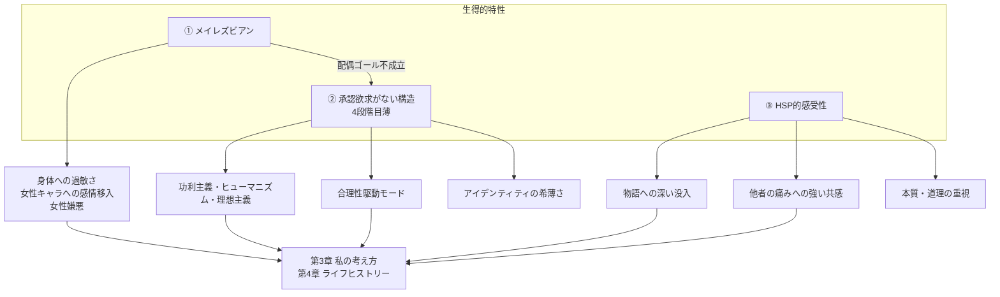

---
tags:
  - 私の特性
---

# 2. 私の特性

私を構成しているのは、**三つの生得的特性**と、そこから派生する複数の特性だ。

派生はすべて生得から導出できる、というのが私の現時点の自己理解の到達点になっている。

## このセクションの構成

- [三本柱（生得的特性）](01_三本柱.md) — メイレズビアン／承認欲求の不在／HSP
- [メイレズビアン](02_メイレズビアン.md) — 第一の柱の詳細
- [承認欲求がない構造](03_承認欲求がない構造.md) — 第二の柱の詳細
- [HSP的感受性](04_HSP的感受性.md) — 第三の柱の詳細
- [4段階目薄人間](05_4段階目薄人間.md) — 「承認欲求がない」を当事者用語で再定義した造語
- [派生的特性のマップ](06_派生的特性のマップ.md) — 三本柱から派生する6つの特性

## 全体図

## 章番号についての注意

このセクションの章番号は私のエッセイ原本（`/自身のエッセイ/02_自分の特性`）の章番号と独立に振り直してある。エッセイ原本の番号と対応させたい場合は次の通り：

| 当サイト | エッセイ原本 | 内容 |
| --- | --- | --- |
| 02-01 三本柱 | 02-0 自分の特性 | 概観 |
| 02-02 メイレズビアン | 01-1, 01-2-3, 02-3 | 性自認・身体感覚 |
| 02-03 承認欲求がない構造 | 01-2, 04-1 | 承認欲求の体系的検証 |
| 02-04 HSP的感受性 | 02-2, 02-4 | 感受性の派生 |
| 02-05 4段階目薄人間 | 哲学/2026-04-30, 2026-05-01 | 当事者用語の確立 |
| 02-06 派生的特性のマップ | 02-1, 02-2, 02-3, 02-4, 02-5, 02-6 | 派生特性の俯瞰 |
