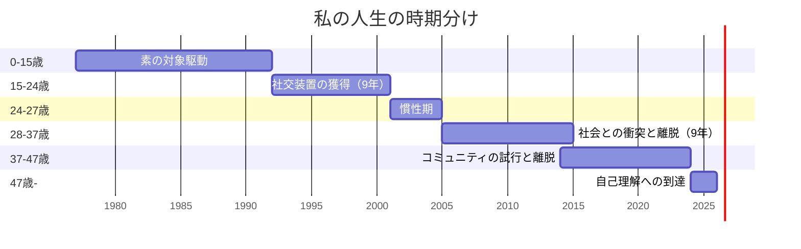

---
tags:
  - ライフヒストリー
  - 9年×2サイクル
---

# 4. ライフヒストリー

私の47年を、「9年×2サイクル仮説」を踏まえて時期分けした自伝。事実情報は[簡易年表](../01_自己紹介/03_簡易年表.md)、各時期の理論的整理は[9年×2サイクル仮説](../06_仮説と理論/02_9年2サイクル仮説.md)。

## 時期分け

## このセクションの構成

- [0-15歳 素の対象駆動](01_0-15歳_素の対象駆動.md)
- [15-24歳 社交装置の獲得](02_15-24歳_社交装置の獲得.md)
- [24-27歳 慣性と崩壊](03_24-27歳_慣性と崩壊.md)
- [28-37歳 社会との衝突と離脱](04_28-37歳_社会との衝突と離脱.md)
- [37-47歳 コミュニティの試行と離脱](05_37-47歳_コミュニティの試行と離脱.md)
- [47歳 自己理解への到達](06_47歳_自己理解への到達.md)

## 「9年×2サイクル」とは

私の人生には対称的な9年が二回ある：

- **15-24歳: 社交装置の獲得（9年）** — 経済的自立というメタ課題のもとで、社会の動作原理を内側から学習
- **28-37歳: 社会との衝突と離脱（9年）** — メタ課題の慣性が尽きた後、本来の駆動モードに戻ろうとして社会と衝突した9年

15-24歳で「9割側（承認回路で動く多数派）の原理」を学習し、28-37歳で「9割側の原理から離脱する判断」に至った。**入って出てきた稀な経歴**だ。

理論的詳細は[9年×2サイクル仮説](../06_仮説と理論/02_9年2サイクル仮説.md)。
