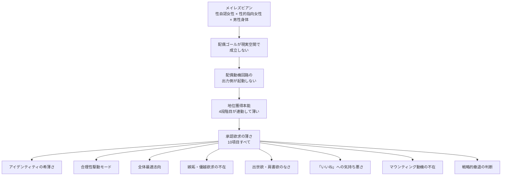

---
tags:
  - 仮説と理論
  - 配偶動機
  - 地位獲得本能
  - 承認欲求
  - 中核仮説
---

# 配偶動機-地位獲得本能の連動仮説

私の人生のあらゆる現象を統合的に説明する **中核仮説**。

## 仮説の中核命題

> **メイレズビアン → 配偶ゴール不成立 → 配偶動機回路の出力側不発動 → 地位獲得本能不発動 → 承認欲求の薄さ → 47年の違和感の全現象**

## 詳細な因果連鎖

## 仮説の各ステップの説明

### Step 1: メイレズビアン

私は生物学的男性、性自認女性、性的指向女性。

- 出生時に男性として割り当てられた（AMAB）
- 内面では女性として、女性に惹かれている
- 47歳のときに気づいた

詳細は [メイレズビアン](../02_私の特性/02_メイレズビアン.md)。

### Step 2: 配偶ゴール不成立

人間の本能には、配偶（繁殖機会の獲得）に向かう動機が組み込まれている。

私の場合：
- 男性身体だが、内面は女性として女性を愛したい
- 男性として女性を愛するヘテロセクシュアル男性のフレームでは、性的興奮も恋愛感情も発動しない
- 女性として女性を愛するレズビアンのフレームは、男性身体では現実空間で成立させにくい
- → 配偶ゴールが現実空間で成立しない

これは「望みがない」ではなく、「本能的な配偶ゴール回路が、私の身体と性自認の組み合わせでは収束しない」状態だ。

### Step 3: 配偶動機回路の出力側不発動

配偶動機の回路は、ゴールが見えると **出力側** （行動を生成する側）が動く：

- 異性に好かれるための行動
- 競争相手に勝つための行動
- 集団内で目立つための行動
- リソースを蓄積するための行動

これらは配偶ゴールに向けた手段として進化的に組み込まれている。

私の場合、ゴールが収束しないので、出力側が起動しない。**配偶のための行動を生成する動機が湧かない**。

### Step 4: 地位獲得本能（4段階目）不発動

配偶のための行動の中で最も重要なのが、**地位獲得**だ。

- 集団内ヒエラルキーで上位を目指す
- 他者から認められる
- リソースの優先アクセス権を得る
- これが配偶機会を増やす

地位獲得本能は配偶動機の **手段** として進化した。手段が必要ない（=配偶ゴールが起動しない）と、地位獲得本能も連動して動かない。

これがマズローの4段階目（承認欲求）の薄さの正体だ。

### Step 5: 承認欲求の薄さ → 47年の全現象

地位獲得本能が薄いと：

- 他者からの承認を求める動機がない（10項目すべて）
- 比較・優越欲求がない
- 注目・可視性を求めない
- 集団内評価への動機がない
- 自己肯定の基底が弱い
- 守るべきアイデンティティが形成されにくい

これらが47年間の私の現象（5章 根拠とエピソード）のすべてを説明する。

## なぜこの仮説が中核なのか

この仮説は私の自己理解の中で **最も多くの現象を統合的に説明する** からだ。

| 説明される現象 | 説明される章 |
| --- | --- |
| メイレズビアンとしての身体・嗜好 | 身体的傍証 |
| 承認欲求の不在（10項目） | 承認欲求10項目検証 |
| 全体最適志向（ケーキの話） | 認知的傍証 |
| 社会主義への共感 | 認知的傍証 |
| 殴られた相手の気持ち悪さ | 認知的傍証 |
| カレーランチのアイデンティティ希薄 | 認知的傍証 |
| 9年×2サイクルの社会との衝突 | [9年×2サイクル仮説](02_9年2サイクル仮説.md) |
| 通貨レート違い | [通貨レート違い仮説](03_通貨レート違い仮説.md) |
| 4段階目薄人間としての生き方 | [4段階目薄人間](../02_私の特性/05_4段階目薄人間.md) |
| 戦略的撤退の判断 | 価値観の体系 |

## 学術的接続

この仮説は次の学術的知見と接続する：

### 脳の領域別性分化

- **Swaab** 等の研究：脳のいくつかの領域は性別で分化する。視床下部前部、扁桃体、白質構造など
- **Joel** の「性別モザイク」研究：脳の各領域の性別性は独立に決定され、男女のバイモーダル分布ではなくモザイクになる
- **Baron-Cohen** の Empathizing-Systemizing 理論：脳の Empathy 系と Systemizing 系の発達バランスに性差
- **LeVay** の INAH3 研究：性的指向と視床下部前部の構造の関連

これらの研究は、私の仮説（配偶ゴールに関する脳の処理が、身体性別と一致しない場合がある）と整合する。

### 進化心理学

- **Trivers** の親投資理論：配偶戦略は性別で異なる
- **Buss** の配偶の性差研究：配偶ゴールが地位獲得本能と連動する
- 性ホルモンの影響：configuration は出生前に決定される部分が大きい

これらの研究は、配偶動機と地位獲得本能の連動が進化的に組み込まれていることを支持する。

### 進化生物学

- **DNA適応 vs 脳適応**：承認欲求は数百万年スケールのDNA適応、合理性は数十年スケールの脳適応
- 現代社会の変化速度は DNA 適応の限界を超える → 進化的ミスマッチ

これは 世界観と人間観 の進化的ミスマッチ視点と接続する。

## 仮説の検証可能性

サンプル数1の自己観察に基づく仮説だが、検証可能な側面がある：

### 一般化への検証

- アセクシャル（配偶ゴール不成立）の人にも承認欲求の薄さが観察されるか？ → 私の友人の例では Yes
- 性同一性障害（配偶ゴールの収束困難）の人にも承認欲求の構造的薄さが見られるか？ → 統計的検証が必要

### 因果の方向への検証

- 配偶ゴール不成立 → 承認欲求の薄さ という因果
- 逆方向（承認欲求の薄さ → 配偶ゴール不成立）はあり得るか？
- 共通原因（脳の特定の発達パターン）から両者が独立に出てくる可能性はあるか？

これらは未解決の問いとして [TASKS](https://github.com/annachloe2025/SelfAnalysis/blob/main/TASKS.md) に残してある。

## 仮説の限界

- サンプル数1
- 因果の方向は厳密には確定していない
- 「配偶ゴール不成立」を本当に厳密に定義するのが難しい（全くゼロではないかもしれない）
- HSP の組み合わせとの相互作用が未整理

これらは 思考フレームの限界 で論じた弱点と一致する。

## なぜこの仮説に確信を持っているか

サンプル数1で因果が完全には確定していないにもかかわらず、私が仮説に確信を持っている理由は：

1. **独立した観察データが一つのモデルに収束する**（[整合性による真理性の感覚](06_整合性による真理性の感覚.md)）
2. **学術的研究と整合する**（脳の領域別性分化、配偶戦略の性差）
3. **47年間の人生現象が事後的に再解釈できる**
4. **同類少数派の観察と整合する**（アセクシャル友人の例）
5. **47歳でこの仮説が出揃った瞬間に、過去のあらゆる違和感が氷解した**

確信は「絶対正しい」ではなく「現時点で最も整合的な説明」というステータス。これが私の仮説立証の認識様式だ。

## 関連ページ

- [メイレズビアン](../02_私の特性/02_メイレズビアン.md)
- [承認欲求がない構造](../02_私の特性/03_承認欲求がない構造.md)
- [4段階目薄人間](../02_私の特性/05_4段階目薄人間.md)
- [整合性による真理性の感覚](06_整合性による真理性の感覚.md)
- [9年×2サイクル仮説](02_9年2サイクル仮説.md)
- [通貨レート違い仮説](03_通貨レート違い仮説.md)

## 関連エッセイ・記事

- `MyConsiderations/docs/哲学/2026-04-30_承認欲求がない構造_配偶動機と地位獲得本能の連動仮説.md`
- `_archive/承認欲求がない構造元データ.md`
- `自身のエッセイ/04_その考えに至った背景/04-1_マズローの5段階欲求における承認欲求がほとんどないこと/`
