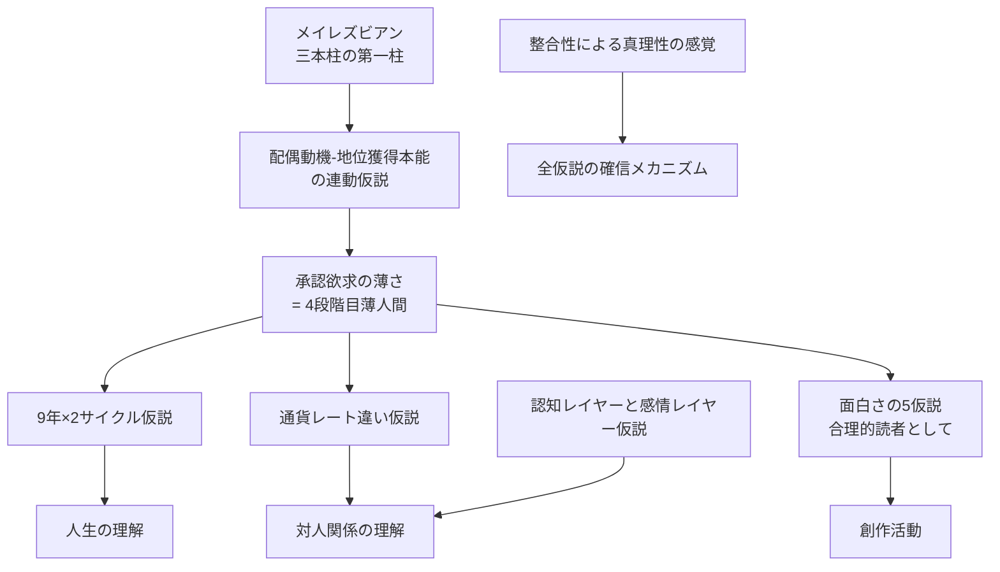

---
tags:
  - 仮説と理論
---

# 6. 仮説と理論

47年生きてきて、自分を理解するために組み立てた **自家製仮説** を体系化する章。

これらは個別の現象を説明するために独立に発生した仮説群だが、相互に整合し、一つの大きな世界観を構成している。すべてサンプル数1の自己観察に基づくため「あくまで仮説」だが、独立した観察データが一つのモデルに収束することで、私の中での確信を形成している（[整合性による真理性の感覚](06_整合性による真理性の感覚.md)）。

## このセクションの構成

- [配偶動機-地位獲得本能の連動仮説](01_配偶動機-地位獲得本能の連動仮説.md) — 中核仮説
- [9年×2サイクル仮説](02_9年2サイクル仮説.md) — 人生のリズム
- [通貨レート違い仮説](03_通貨レート違い仮説.md) — 対人摩擦の構造
- [認知レイヤーと感情レイヤー仮説](04_認知レイヤーと感情レイヤー仮説.md) — 会話の二層モデル
- [面白さの5仮説と飽きの3パターン](05_面白さの5仮説.md) — 創作論の基盤
- [整合性による真理性の感覚](06_整合性による真理性の感覚.md) — 私の真理判定メカニズム

## 仮説間の関係



## なぜ「仮説」と呼ぶのか

私はこれらを「仮説」と呼び、「理論」「結論」「真理」と呼ばない。

- サンプル数1の自己観察に基づく
- 検証可能な反例があれば修正する
- 「現時点での到達点」であり、永続的な真理ではない
- 他の人にも当てはまるかは別途検証が必要

これは [思考フレーム](../03_私の考え方/02_思考フレーム.md) の「サンプル数1の自覚」と「整合性による真理性の感覚」の両方を反映している。

私は仮説を確信する瞬間を持つが、その確信は「絶対正しい」ではなく「現時点で最も整合的な説明」というステータスだ。

## 各仮説のサマリ

### 配偶動機-地位獲得本能の連動仮説

```
メイレズビアン → 配偶ゴール不成立 → 配偶動機回路の出力側不発動
                                              ↓
                              地位獲得本能（4段階目）不発動
                                              ↓
                              承認欲求の薄さ
```

私の人生のあらゆる現象を統合的に説明する **中核仮説**。

### 9年×2サイクル仮説

15-24歳「社交装置の獲得」9年と、28-37歳「社会との衝突と離脱」9年の対称構造。中間に24-27歳の慣性期。

### 通貨レート違い仮説

合理通貨で動く私と、承認通貨で動く多数派の間で、為替レートが成立しない。これがコミュニティ失敗・友人関係の摩擦の構造的原因。

### 認知レイヤーと感情レイヤー仮説

会話には二つの層がある。System1（感情）と System2（認知）の両方が同時に動く。多数派は感情レイヤーを優先するが、私は認知レイヤーで会話したい。これが噛み合わなさの正体。

### 面白さの5仮説と飽きの3パターン

物語の面白さは、A〜Eの5つのメカニズムが複合的に効く。飽きは「整合的な新規情報の流入速度の低下」で説明される。これが [創作論](../03_私の考え方/05_創作論.md) と [自分専用生成システム](../08_今とこれから/03_自分専用生成システム.md) の基盤。

### 整合性による真理性の感覚

独立した観察が一つのモデルに収束したときに発動する確信。確証バイアスとは別物。私の真理判定の認識様式の核。
