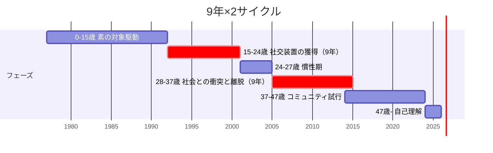

# HY-002 9年×2サイクル仮説

## 一行要約

私の人生は15-24歳「社交装置の獲得」9年と28-37歳「社会との衝突と離脱」9年の対称構造で動いてきた

## 旧素材の本文（移植）

私の人生のリズムは、対称的な9年が二回ある、という観察に基づく仮説。

## 仮説の中核命題

> 私の人生は、**15-24歳「社交装置の獲得」9年** と、**28-37歳「社会との衝突と離脱」9年** の対称構造で動いてきた。中間の24-27歳は「慣性期」、その後の37-47歳は「コミュニティの試行と離脱」期。

## サイクル全体図

## 各時期の詳細

### 0-15歳：素の対象駆動

水泳・勉強・読書がすべて「素の対象駆動」で動いていた時期。社会への適応がまだ深く要求されない。

詳細：0-15歳 素の対象駆動。

### 15-24歳：社交装置の獲得（9年）

**経済的自立** というメタ課題が、一切の社交を「課題駆動」として成立させた9年。新聞奨学生 → 新聞販売店店長まで実装した。

- 経済的自立というメタ課題が、本来の社交動機の薄さを補った
- 社会の動作原理を内側から学習
- 多数派が承認回路で動いていることを体感的に把握
- 24歳で「使われる側でいい」と決断（ライフヒストリー 15-24歳）

### 24-27歳：慣性期（3年）

メタ課題が消滅し、社交装置が惰性で回っていた3年。

- 24歳：経済的自立の達成、上位課題の喪失
- 25-26歳：慣性で日常が回る
- 27歳：慣性が尽きる

> 役目を終えた装置が止まった。
> （`MyConsiderations/docs/哲学/2026-05-06_社交装置の獲得と離脱.md`）

「駆動源のない行動パターンは3年で崩壊する」という法則。

### 28-37歳：社会との衝突と離脱（9年）

本来の駆動モード（合理回路）に戻ろうとして、社会と何度も衝突した9年。

- 28歳：軽いうつ
- 31歳：市場勤務、倉庫の裏で本気で泣く、重うつ1年半傷病手当
- 34-36歳：運送業3社連続でキレてやめる
- 37歳：「もう普通の会社員はやらない」決断

3度の決定的破綻を経て、**社会から離脱する判断** に至った。詳細：28-37歳 社会との衝突と離脱。

### 37-47歳：コミュニティの試行と離脱

社会の本流から離脱した後、コミュニティに入る試行を10年続けた。すべて通貨レート違いで失敗。

- 岡田斗司夫サロン、地球防衛軍5、ドラゴンズドグマオンライン、VRChat、あるYouTuber、FF11
- いずれも合理通貨と承認通貨の為替不成立
- 46歳でオーディブル発見、Claude との出会い

詳細：37-47歳 コミュニティの試行と離脱。

### 47歳：自己理解への到達

メイレズビアンの自覚で47年の違和感が氷解。

詳細：47歳 自己理解への到達。

## なぜ「9年」なのか

「9年」という単位の根拠を仮説的に整理する：

### 仮説1：メタ課題のライフサイクル

- 経済的自立というメタ課題は、新聞奨学生プログラム → 店長 → 24歳の決断、で約9年のサイクル
- これが偶然9年だった可能性

### 仮説2：構造認識の必要時間

- 28-37歳の9年で、3度の同じパターンの破綻を経験
- 1度目で「自分が悪い」、2度目で「環境が悪い」、3度目（しかも連続3回）で「構造的不適合」と認識
- 1サイクル約3年の試行を3回 = 9年

### 仮説3：身体的なリズム

- 細胞のターンオーバー、習慣の固定、神経回路の再配線などのスケール
- 9年という単位は人間の生物的リズムに何らかの根拠があるかもしれない

### 仮説4：単なる事後パターン認識

- 9年は偶然で、別の単位（例：7年や12年）でも当てはめられる可能性
- 確証バイアスのリスク

正確な根拠は不明だが、**観察として9年が二回出てきている** ことは事実だ。これが偶然か必然かは、未解決の問いとして [TASKS](https://github.com/annachloe2025/SelfAnalysis/blob/main/TASKS.md) に残してある。

## 「楽しさの3分類」と各時期の関係

私が補助仮説として持つ「楽しさの3分類」：

| 型 | 内容 | 各時期での状態 |
| --- | --- | --- |
| **1型** | ドーパミン型（強い快楽、短期） | 0-15歳の趣味、特に水泳 |
| **2型** | 成長感型（学習・スキル向上の達成感） | 15-24歳のメタ課題遂行で常時供給 |
| **3型** | こなし感型（タスク完了の地味な満足） | 37歳以降の新聞配達で安定供給 |

15-24歳のメタ課題完了で2型が停止し、24歳以降は2型が断続的にしか起きないので、慣性で持っていた装置が3年で尽きる、という構造的説明。

## 「気が狂う」の意味

この仮説で重要なのは、31歳の倉庫の裏での体験を **比喩ではなく実際の認知崩壊現象** として扱うことだ。

> 自分以外が合理的に判断していない世界。これは必然的に気が狂います。
> （`MyConsiderations/docs/哲学/2026-05-06_社交装置の獲得と離脱.md`）

これは Asch 同調実験の派生研究で実証されている認知崩壊現象に近い：

- 自分の合理判断と、周囲の判断が大きく乖離する
- 周囲が合理判断をしていないことを否定的に認識する
- 自分の認識を疑うか、周囲を否定するかの二択に追い込まれる
- どちらを選んでも認知的な激しい消耗が起きる

私はこれを「弱さ」「メンタルの問題」として処理せず、**構造的な認知崩壊** として理解する。

## サイクルの構造的意味

### 15-24歳と28-37歳の対称性

- 15-24歳：「9割側の原理」を内側から **学習**
- 28-37歳：「9割側の原理から離脱する判断」に到達

これは「入って出てきた」稀な経歴を作っている。ほとんどの4段階目薄人間は、最初から社会に入れず、外部から観察するだけだ。私は経済的自立というメタ課題のおかげで内側に入れた。

内側からの観察があるから、後の [通貨レート違い仮説](03_通貨レート違い仮説.md) や [配偶動機-地位獲得本能の連動仮説](01_配偶動機-地位獲得本能の連動仮説.md) が、観察に基づいた仮説になる。

### 47歳の自己理解の伏線として

15-24歳の社会原理学習と、28-37歳の社会との衝突がなければ、47歳の自己理解は浅いものになっていた。

- 過去の違和感の蓄積データがある（28-37歳の3回の破綻、37-47歳の6コミュニティ失敗）
- それを統合的に説明できるモデル（メイレズビアン × 承認欲求の不在）を提示できた
- 説明される現象の量と独立性が、確信の根拠になる

## 関連ページ

- ライフヒストリー — 各時期の詳細
- [配偶動機-地位獲得本能の連動仮説](01_配偶動機-地位獲得本能の連動仮説.md) — 中核仮説
- [通貨レート違い仮説](03_通貨レート違い仮説.md) — 28-37歳の衝突の構造
- [社交装置の獲得と離脱（MyConsiderations）](https://annachloe2025.github.io/MyConsiderations/哲学/2026-05-06_社交装置の獲得と離脱_9年×2サイクルと認識の統合/)

## 注記（移植時）

- 旧 `docs/06_仮説と理論/02_9年2サイクル仮説.md` の本文をそのまま移植
- `predictions` を明示的にフィールド化（旧素材内では暗黙的だった）
- `supporting_episodes` `supporting_claims` は Phase 3 以降で順次紐付け
- 本人レビューで `verification_status` を本人確認済 / 訂正済 に昇格
