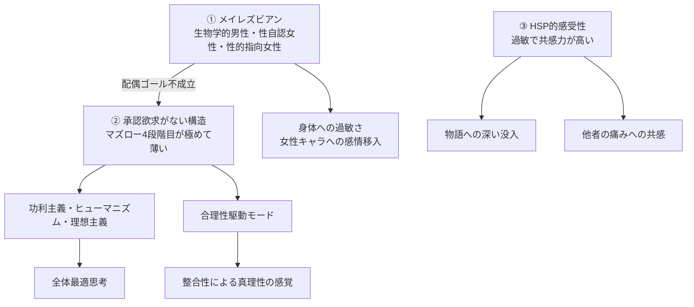

---
tags:
  - はじめに
  - 自己紹介
---

# 私という人間

47歳になって、ようやく自分が何者か掴めた。
そのことを、自分の手で言葉にして、ここに残しておく。

このサイトは、**私（hoehoe）が私を語る**ための場所だ。
47年分のエッセイ、AIとの対話、考察ノートの中から生まれた気づきを、
**214 件の atom（原子的単位）** に分解し、複数の視点から組み立て直したものになっている。

## 一行で言うと

> 生物学的には男性として生まれ、性自認は女性、性的指向もまた女性。マズローでいう承認欲求（社会的立場を獲得したい本能）が極めて薄く、その代わりに合理性と整合性で世界を判定して動いている人間。

これに気づいたのは47歳のときで、それまでの47年間、自分が他人と何が違うのかをずっと探していた。

これは「強み」でも「特技」でもなく、**生得的にこの体質を持って生まれたがゆえに、現状こうなってしまった**という構造的な出発点として書いている。

---

## どこから読みますか

時間と興味に応じて、複数の入口を用意している。

### 短時間で輪郭を掴みたい人

- **[エレベーターピッチ的な入口](views/用途別/AI引き継ぎビュー.md)** — 30秒〜3分で本人を把握
- **[履歴書ビュー](views/用途別/履歴書ビュー.md)** — 採用担当・初対面の人向け、5分

### 体系的に理解したい人

1. **[メイレズビアンレンズ](views/主題別/メイレズビアンレンズ.md)** — 性同一性に関連する全 atom を一望（15-20分）
2. **[承認欲求レンズ](views/主題別/承認欲求レンズ.md)** — マズロー4段階目の不在を一望（15-20分）
3. **[HSPレンズ](views/主題別/HSPレンズ.md)** — 感受性の高さを一望（10-15分）
4. **[合理性駆動レンズ](views/主題別/合理性駆動レンズ.md)** — 認識様式と思想（10-15分）
5. **[9年×2サイクル伝記](views/時系列/9年×2サイクル伝記.md)** — 人生全体の流れ（15-20分）

### 興味別に入る

- 性同一性から → [メイレズビアンレンズ](views/主題別/メイレズビアンレンズ.md)
- 思想から → [合理性駆動レンズ](views/主題別/合理性駆動レンズ.md)
- キャリアから → [簡易年表](views/時系列/簡易年表.md)
- 趣味から → [全エピソード索引](views/抽象度別/全エピソード索引.md)
- 仮説から → [HY 全 6 件のカタログ](data/hypotheses/index.md)

### データを直接見たい人

- [全エピソード索引（42件）](views/抽象度別/全エピソード索引.md)
- [全主張カタログ（50件）](data/claims/index.md)
- [全仮説マップ（6件）](data/hypotheses/index.md)
- [用語集（12件）](data/concepts/index.md)
- [全 atom 索引（ビュー層トップ）](views/index.md)

---

## 三つの生得的特性

私を構成している先天的な特性は、三つある。



派生する思想・行動・人生の選択は、すべてこの三つの組み合わせから説明できる、というのが私の現時点での到達点だ。

---

## このサイトの構造

```
docs/
├── index.md           ← このページ（入口）
├── data/              ← データ層：214 件の atom（正本）
│   ├── episodes/      EP-001〜042（一回の出来事）
│   ├── claims/        CL-001〜050（私が抱く命題）
│   ├── hypotheses/    HY-001〜006（自家製仮説）
│   ├── concepts/      CO-001〜012（独自用語）
│   ├── values/        VL-001〜011（価値観）
│   ├── facts/         FA-001〜035（履歴書事実）
│   ├── people/        PP-001〜007（関係者）
│   ├── periods/       TP-001〜007（人生の時期）
│   ├── theories/      TH-001〜009（外部理論）
│   ├── influences/    IN-001〜018（影響源）
│   ├── reactions/     RP-001〜011（反応パターン）
│   └── behaviors/     BP-001〜006（行動パターン）
└── views/             ← ビュー層：データ層を視点別に束ね直した読み物
    ├── 主題別/        メイレズビアン／HSP／承認欲求／合理性駆動 レンズ
    ├── 時系列/        9年×2サイクル伝記、簡易年表
    ├── 抽象度別/      全エピソード索引
    └── 用途別/        履歴書ビュー、AI引き継ぎビュー
```

設計思想は [_design/00_設計サマリー.md](../_design/00_設計サマリー.md) に記載。

---

## このサイトの特徴

- **「私が私を語る」** スタイルで一貫している。客観的な分析にも見えるが、主語はずっと「私」
- **事実とデータを淡々と並べる** ことを優先する
- **「サンプル数1」「あくまで仮説」「現時点での結論」** という相対化のフレーズを大事にする
- **断定を避ける慎重さ** と **自分の発見への確信** が両立している
- **機微情報**（性同一性、うつ病歴、人間関係の失敗、家族構成）は **隠さず正確に** 書いている
- **生得的特性を「強み」「特技」のように扱わない**。本人の認識は「生得的にこの体質ゆえに現状こうなった」

---

## 連動するプロジェクト

このサイトと並行して、以下のプロジェクトを運営している。

- **[日々の気づき (MyConsiderations)](https://annachloe2025.github.io/MyConsiderations/)** — 日常の中で生まれた小さな考察を貯めるブログ。哲学・文学・社会・言語・AI・健康のカテゴリで運用中

---

## 参考までに

このサイトは MkDocs（Material for MkDocs）でビルドして GitHub Pages に公開している。
リポは <https://github.com/annachloe2025/SelfAnalysis>。
