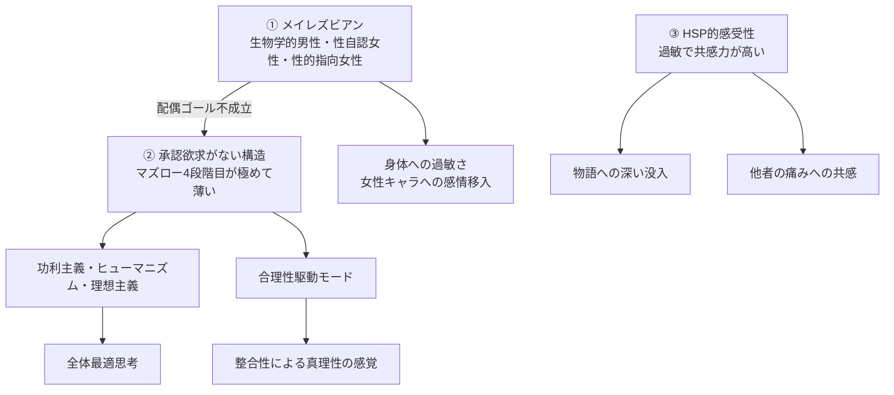

---
tags:
  - はじめに
  - 自己紹介
---

# 私という人間

47歳になって、ようやく自分が何者か掴めた。
そのことを、自分の手で言葉にして、ここに残しておく。

このサイトは、**私（hoehoe）が私を語る**ための場所だ。長年のエッセイと、AIとの対話の中で生まれた気づきを、一冊の地図として組み直したものだと思ってもらえばいい。

## 一行で言うと

> 生物学的には男性として生まれ、性自認は女性、性的指向もまた女性。マズローでいう承認欲求（社会的立場を獲得したい本能）が極めて薄く、その代わりに合理性と整合性で世界を判定して動いている人間。

これに気づいたのは47歳のときで、それまでの47年間、自分が他人と何が違うのかをずっと探していた。

## このサイトの読み方

時間がない人へ。次の二つだけ読めば、私の輪郭は掴める。

- [エレベーターピッチ](01_自己紹介/01_エレベーターピッチ.md) — 5行で私を説明する
- [三本柱（生得的特性）](02_私の特性/01_三本柱.md) — 私を理解する鍵となる三つの特性

時間がある人へ。次の順で読むと体系的に追える。

1. [自己紹介](01_自己紹介/index.md) — 履歴書相当の事実情報と簡易年表
2. [私の特性](02_私の特性/index.md) — 三本柱とそこから派生する特性のマップ
3. [私の考え方](03_私の考え方/index.md) — 価値観の体系、思考フレーム、世界観
4. [ライフヒストリー](04_ライフヒストリー/index.md) — 9年×2サイクルで分けた自伝
5. [根拠とエピソード](05_根拠とエピソード/index.md) — 主張ごとの裏付け体験
6. [仮説と理論](06_仮説と理論/index.md) — 自家製仮説の体系
7. [作品と趣味](07_作品と趣味/index.md) — 嗜好データと技術スタック
8. [今とこれから](08_今とこれから/index.md) — 現在地と展望

## 三本柱

私を構成している生得的な特性は、三つある。

派生する特性、思考、思想、社会との衝突、人生の選択は、すべてこの三本柱から説明できる。これが私の自己理解の到達点だ。

詳細は [三本柱](02_私の特性/01_三本柱.md) 参照。

## このサイトの特徴

- **私が私を語る** スタイルで一貫している。客観的な分析にも見えるが、主語はずっと「私」
- **事実とデータを淡々と並べる** ことを優先する。感情の表出は、本人が当時感じた感情として埋め込む形のみ
- **「サンプル数1」「あくまで仮説」「現時点での結論」** という相対化のフレーズを大事にする
- **断定を避ける慎重さ**と、**自分の発見への確信**が両立している
- 機微情報（性同一性、うつ病歴、人間関係の失敗、家族構成）は **隠さず正確に** 書いている。隠すと自己分析が成立しないので

## 連動するプロジェクト

このサイトと並行して、以下のプロジェクトを運営している。

- **[日々の気づき (MyConsiderations)](https://annachloe2025.github.io/MyConsiderations/)** — 日常の中で生まれた小さな考察を貯めるブログ。哲学・文学・社会・言語・AI・健康のカテゴリで運用中。SelfAnalysis の各仮説の発生元になっている記事も多い

## 参考までに

このサイトは MkDocs（Material for MkDocs）でビルドして GitHub Pages に公開している。リポは <https://github.com/annachloe2025/SelfAnalysis>。
