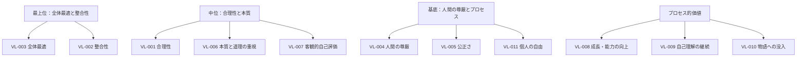

# 価値観体系

本人が大切にしている価値（VL）の階層構造を可視化する。

> 自動生成版（タイトルのみ）は [docs/data/values/index.md](../../data/values/index.md) を参照。

---

## 階層図

---

## 全 VL リスト（11 件）

### 高優先度（priority: 高）

- [VL-001 合理性](../../data/values/VL-001_合理性.md)
- [VL-002 整合性](../../data/values/VL-002_整合性.md)
- [VL-003 全体最適](../../data/values/VL-003_全体最適.md)
- [VL-004 人間の尊厳](../../data/values/VL-004_人間の尊厳.md)
- [VL-005 公正さ](../../data/values/VL-005_公正さ.md)
- [VL-006 本質と道理の重視](../../data/values/VL-006_本質と道理の重視.md)
- [VL-007 客観的自己評価](../../data/values/VL-007_客観的自己評価.md)
- [VL-009 自己理解の継続](../../data/values/VL-009_自己理解の継続.md)

### 中優先度（priority: 中）

- [VL-008 成長・能力の向上](../../data/values/VL-008_成長・能力の向上.md)
- [VL-010 物語への没入](../../data/values/VL-010_物語への没入.md)
- [VL-011 個人の自由](../../data/values/VL-011_個人の自由.md)

---

## 重要視するもの / 重要視しないもの

| 重要視する | 重要視しない |
| --- | --- |
| 全体の幸福・合理性 | 地位・肩書・権威 |
| 物事の本質と道理 | 他者からの評価・賞賛 |
| 人の尊厳と公正さ | 競争での勝利・優越感 |
| 自己理解・自己分析 | SNSでの承認・注目 |
| 成長・能力の向上 | 所属集団での立場 |

これは「強み」を誇るリストではなく、**動機回路として機能するもの／しないもの**の対比である。

---

## 価値観間の関係

- **VL-001 合理性**と **VL-002 整合性** は、ほぼ同じ方向の価値だが粒度が違う：合理性が判定基準、整合性が判定対象の性質
- **VL-003 全体最適** は **VL-001 合理性** の社会的応用。合理判定を全体に適用する
- **VL-004 人間の尊厳** と **VL-005 公正さ** は、HSP × 承認欲求の不在 × メイレズビアン から自然に派生する基底価値
- **VL-007 客観的自己評価** は **VL-001 合理性** を自分自身に適用したもの
- **VL-009 自己理解の継続** は本人の人生のメタ価値。SelfAnalysis プロジェクト自体の動機

---

## 関連ビュー

- [合理性駆動レンズ](../主題別/合理性駆動レンズ.md) — VL-001/002/003/006/007 が中心
- [ヒューマニズムレンズ](../主題別/ヒューマニズムレンズ.md) — VL-004/005 が中心
- [創作・物語レンズ](../主題別/創作・物語レンズ.md) — VL-010 が中心
