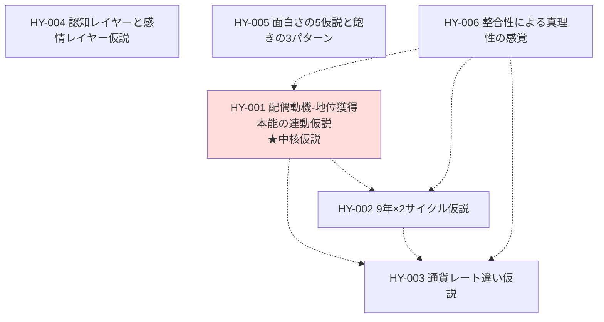

# 全仮説マップ

データ層の全 HY（自家製仮説）を、依存関係の地図として整理する。

> 自動生成版（タイトルのみ）は [docs/data/hypotheses/index.md](../../data/hypotheses/index.md) を参照。

---

## 仮説間の関係図

中核仮説 HY-001 から派生する形で、HY-002 / HY-003 が観察基盤を提供。HY-006（整合性による真理性の感覚）は本人の認識様式そのものの仮説で、他の仮説の確信度を支える。

---

## 各仮説の概要

### HY-001 配偶動機-地位獲得本能の連動仮説 `★中核`

→ [HY-001 詳細](../../data/hypotheses/HY-001_配偶動機-地位獲得本能の連動仮説.md)

> メイレズビアン → 配偶ゴール不成立 → 配偶動機回路不発動 → 地位獲得本能不発動 → 承認欲求の薄さ

本人の人生のあらゆる現象を統合的に説明する中核仮説。

### HY-002 9年×2サイクル仮説

→ [HY-002 詳細](../../data/hypotheses/HY-002_9年×2サイクル仮説.md)

> 私の人生は 15-24 歳「社交装置の獲得」9 年 と 28-37 歳「社会との衝突と離脱」9 年 の対称構造で動いてきた

ライフヒストリー全体の構造的説明。

### HY-003 通貨レート違い仮説

→ [HY-003 詳細](../../data/hypotheses/HY-003_通貨レート違い仮説.md)

> 合理通貨で動く本人と、承認通貨で動く多数派の互換性のなさが、コミュニティ参加の失敗を構造的に説明する

社会との摩擦の構造的説明。

### HY-004 認知レイヤーと感情レイヤー仮説

→ [HY-004 詳細](../../data/hypotheses/HY-004_認知レイヤーと感情レイヤー仮説.md)

> 会話には認知レイヤーと感情レイヤーがあり、本人は前者で動き、多数派は後者で動くため噛み合わない

会話の二層モデル。

### HY-005 面白さの5仮説と飽きの3パターン

→ [HY-005 詳細](../../data/hypotheses/HY-005_面白さの5仮説と飽きの3パターン.md)

> ライトノベル 200 冊以上の消費観察から導いた、面白さの 5 要素と飽きの 3 パターン

自分専用生成システムの設計指針。

### HY-006 整合性による真理性の感覚

→ [HY-006 詳細](../../data/hypotheses/HY-006_整合性による真理性の感覚.md)

> 独立観察が一つのモデルに収束したときに「これは正しい」という確信を得る、本人の認識様式

メタ仮説。他の仮説の確信度の根拠を与える。

---

## 関連する外部理論

- [TH-001 マズローの欲求段階説](../../data/theories/TH-001_マズローの欲求段階説.md) — HY-001 の前提
- [TH-002 HSP](../../data/theories/TH-002_HSP（Highly Sensitive Person）.md)
- [TH-003 予測符号化（Friston）](../../data/theories/TH-003_予測符号化（Predictive Coding）.md) — HY-006 の生物学的基盤候補
- [TH-004 System1/2（Kahneman）](../../data/theories/TH-004_System1 _ System2 思考.md) — HY-004 の前駆
- [TH-007 ポライトネス理論](../../data/theories/TH-007_ポライトネス理論.md) — HY-004 の社会言語学的背景
- [TH-008 アブダクション](../../data/theories/TH-008_アブダクション（最良の説明への推論）.md) — 本人の中核的推論方法

## 残された問い（仮説段階）

- 9年という単位は本当に必然か、偶然か
- AMABレズビアン と 承認欲求の不在 の因果関係は本当に直結しているか
- 「整合性による真理性の感覚」は確証バイアスとどう区別されるか
- HY-005 の予測精度（自分専用生成システムでの実証で確認可能）

---

## 関連ビュー

- [合理性駆動レンズ](../主題別/合理性駆動レンズ.md) — HY-006 の中核
- [9年×2サイクル伝記](../時系列/9年×2サイクル伝記.md) — HY-002 の物語版
