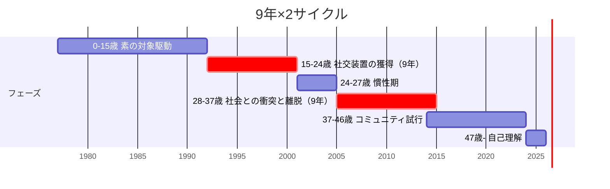

# 9年×2サイクル伝記

このビューは、本人の自家製仮説「9年×2サイクル」（[HY-002](../../data/hypotheses/HY-002_9年×2サイクル仮説.md)）に沿って、人生を時系列で語るものである。

> 私の人生は、**15-24歳「社交装置の獲得」9年** と、**28-37歳「社会との衝突と離脱」9年** の対称構造で動いてきた。

---

## 全体図

---

## 第0期：素の対象駆動（〜15歳）

→ [TP-001 幼少期（〜6歳）](../../data/periods/TP-001_幼少期.md)
→ [TP-002 義務教育期（6-15歳）](../../data/periods/TP-002_義務教育期.md)

水泳・勉強・読書がすべて「素の対象駆動」で動いていた時期。

- 1〜13歳まで水泳教室、小4で県大会出場（[FA-011](../../data/facts/FA-011_1〜13歳まで水泳教室、小4で県大会出場.md)）
- 走り方を「女の子みたい」と複数回指摘される（[EP-002](../../data/episodes/EP-002_走り方が「女の子みたい」と何度も言われた.md)）
- ハイレグで海水パンツのへそを隠す（[EP-001](../../data/episodes/EP-001_海水パンツを引き上げてハイレグでへそを隠していた.md)）
- 中学時代に女性主人公のラノベを無意識に手に取る（[EP-017](../../data/episodes/EP-017_中学生の頃、女性主人公のラノベを無意識に手に取った.md)）

メイレズビアンの兆候はすでに身体感覚レベルで現れているが、本人にはまだ言語化の手段がない。

---

## 第1サイクル：社交装置の獲得（15-24歳・9年）

→ [TP-003 新聞奨学生期（15-24歳）](../../data/periods/TP-003_新聞奨学生期.md)

**経済的自立というメタ課題が、一切の社交を「課題駆動」として成立させた9年**。

- 15歳：高校生アルバイト
- 18歳：新聞奨学生として上京、専門学校入学・住み込み勤務
- 高校終わり頃：エヴァンゲリオンに触れる（[EP-020](../../data/episodes/EP-020_高校終わり頃、エヴァンゲリオンが流行してアニメを見るようになった.md)、[IN-001](../../data/influences/IN-001_エヴァンゲリオン.md)）
- 専門学校時代：推理小説で「頭のいい人の思考」に触れる（[EP-019](../../data/episodes/EP-019_専門学校時代、推理小説で「頭のいい人はこういう思考をする」と感じた.md)）
- 21〜22歳：新聞販売店店長に昇格
- 24歳：「使われる側でいい」と決断、店長を退き実家へ（[EP-035](../../data/episodes/EP-035_新聞販売店店長を辞めて「一生使われる側でいい」と決めた.md)）

**この時期の意味**：「9割側の原理」（=承認回路で動く多数派の世界）を**内側から学習**した9年。これがなければ、後の通貨レート違い仮説や配偶動機-地位獲得本能の連動仮説は、観察基盤を持たない仮説のままだった。

---

## 中間期：慣性期（24-27歳・3年）

→ [TP-004 慣性期（24-27歳）](../../data/periods/TP-004_慣性期.md)

メタ課題が消滅し、社交装置が惰性で回っていた3年。

- 24歳：経済的自立達成、上位課題の喪失
- 25-26歳：実家でアルバイト・派遣
- 27歳：慣性が尽きる

**この時期の意味**：「駆動源のない行動パターンは3年で崩壊する」という法則。

---

## 第2サイクル：社会との衝突と離脱（28-37歳・9年）

→ [TP-005 社会との衝突と離脱期（28-37歳）](../../data/periods/TP-005_社会との衝突と離脱期.md)

本来の駆動モード（合理回路）に戻ろうとして、社会と何度も衝突した9年。

### 3度の決定的破綻

- 28歳：軽いうつ発症、転職転々
- 30歳前後：リーマンショック前後の転職転々
- **31歳：市場勤務（朝3時〜夕方6時）、倉庫の裏で本気で泣いた事件、重うつで1年半傷病手当**（[FA-016](../../data/facts/FA-016_市場勤務・重うつ31歳.md)、[CO-009 倉庫の裏で泣いた](../../data/concepts/CO-009_倉庫の裏で泣いた.md)）
- 34-36歳：運送業3社連続離脱（[EP-012](../../data/episodes/EP-012_仕事をしない人を見ると強い憤りを覚え、会社を辞めた.md)、[FA-017](../../data/facts/FA-017_運送業3社連続離脱34-36歳.md)）
- 36-37歳：うつ病期にアニメで気持ちが楽になる（[EP-022](../../data/episodes/EP-022_20代後半〜30代後半、うつ病の時期にアニメで気持ちが楽になった.md)）
- **37歳：「もう普通の会社員はやらない」決断**

### 倉庫の裏で泣いたことの意味

> 自分以外が合理的に判断していない世界。これは必然的に気が狂います。

これは比喩ではなく**実際の認知崩壊現象**。Asch 同調実験の派生研究で実証されている認知崩壊に近い。
本人はこれを「弱さ」「メンタルの問題」として処理せず、**構造的な認知崩壊**として理解する。

**この時期の意味**：15-24歳に「9割側の原理」を内側から学習した期間と対称的に、本期間は「9割側の原理から離脱する判断」に到達した期間。

---

## 第3期：コミュニティ試行と離脱（37-46歳・10年）

→ [TP-006 コミュニティ試行期（37-46歳）](../../data/periods/TP-006_コミュニティ試行期.md)

社会本流から離脱後、別経路でのコミュニティに入る試行を10年続けた。

### 6つのコミュニティ失敗

すべて[通貨レート違い](../../data/concepts/CO-005_通貨レート違い.md)で離脱：

- 岡田斗司夫サロン（[IN-010](../../data/influences/IN-010_岡田斗司夫サロン.md)）
- 地球防衛軍5（[IN-007](../../data/influences/IN-007_地球防衛軍5.md)、1か月300時間）
- ドラゴンズドグマオンライン（[IN-008](../../data/influences/IN-008_ドラゴンズドグマオンライン.md)）
- VRChat（[IN-009](../../data/influences/IN-009_VRChat.md)）
- あるYouTuberの動画編集バイト
- FF11（[IN-006](../../data/influences/IN-006_FF11ファイナルファンタジーXI.md)、高校友人と1年半で5000時間）

### 並行する観察

- 30代に入って、漫画やアニメに関心がない人が意外に多いと気づく（[EP-021](../../data/episodes/EP-021_30代に入って、漫画やアニメに関心がない人が意外に多いと気づいた.md)）
- アニメを「制作者のように」見る癖（[EP-024](../../data/episodes/EP-024_アニメを「制作者のように」見る癖がある.md)）

### 46歳：オーディブルとの出会い

→ [IN-011 オーディブル](../../data/influences/IN-011_オーディブル.md)
46歳でオーディブル発見、ライトノベル200冊以上消費（[EP-023](../../data/episodes/EP-023_46歳頃、オーディブルで一日中楽しい気分で過ごせるようになった.md)）。47歳の自己理解への伏線になる。

---

## 第4期：自己理解期（46歳〜）

→ [TP-007 自己理解期（46歳〜）](../../data/periods/TP-007_自己理解期.md)

47歳の誕生日後ほぼ1ヶ月で、メイレズビアンの自覚に至る（[EP-040](../../data/episodes/EP-040_47歳でメイレズビアンと気づいたとき「自分の中に魂が入った」感覚.md)）。

> 守るべきアイデンティティそのものが長い間形成されていなかった。47歳でメイレズビアンと気づいて初めて、自分の中に魂が入った。

47年間の違和感がほぼすべて、**メイレズビアン × 承認欲求の不在 × HSP** の三つの生得的特性で説明できる、という整合的な像が立ち上がった。
[整合性による真理性の感覚](../../data/concepts/CO-007_整合性による真理性の感覚.md)が確信を生んだ瞬間。

その後：
- 自家製仮説の体系化（HY-001〜006）
- MyConsiderations 開設（哲学・社会・言語・AI・健康などの考察ブログ）
- SelfAnalysis プロジェクト着手（自己分析の体系化）
- 自分専用ライトノベル生成システムの設計

---

## このサイクルの構造的意味

15-24歳と28-37歳の**対称性**は、「9割側の原理を内側から学習」と「9割側の原理から離脱する判断に到達」という形を取る。
ほとんどの 4 段階目薄人間は、最初から社会に入れず、外部から観察するだけだ。本人は経済的自立というメタ課題のおかげで内側に入れた。
内側からの観察があるから、後の[通貨レート違い仮説](../../data/hypotheses/HY-003_通貨レート違い仮説.md)や[配偶動機-地位獲得本能の連動仮説](../../data/hypotheses/HY-001_配偶動機-地位獲得本能の連動仮説.md)が、観察に基づいた仮説になる。

---

## 関連ビュー

- [簡易年表](簡易年表.md) — 事実だけを時系列で並べたバージョン
- [メイレズビアンレンズ](../主題別/メイレズビアンレンズ.md)
- [承認欲求レンズ](../主題別/承認欲求レンズ.md)
